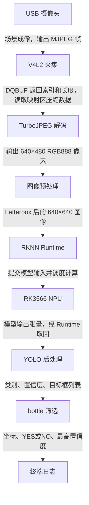
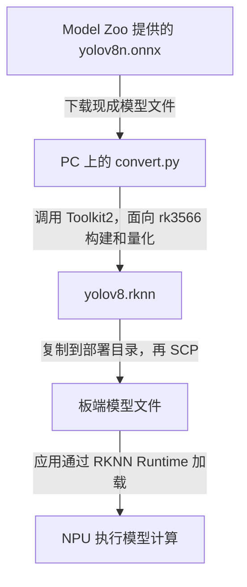
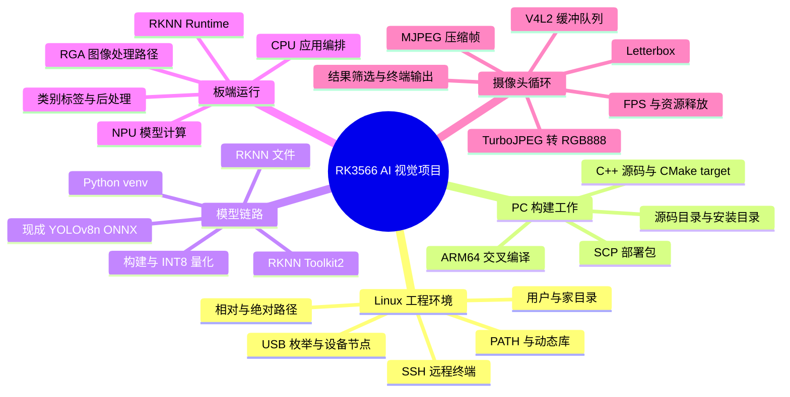

# RK3566 + YOLOv8 + NPU 阶段复盘与复现手册

复盘截止：2026-09-22，实时摄像头检测首次跑通。

**当前成果：基于 Rockchip 现成模型和示例工程，在 RK3566 上跑通了图片检测，并接入 USB 摄像头，实现 C++ 连续采集、解码、NPU 推理和终端 bottle 检测结果输出。尚未完成实时画框显示，也未完成检测结果控制机械手。**

## 阅读约定与证据边界

本复盘以当前可见对话、实际终端日志为主，历史对话检索为补充。不能保证取回了被截断对话中的每一句话。缺失部分明确写成【无法从当前记录确认】，不以常见教程填补历史。

主要证据：

| 编号 | 已核对的记录 | 用途 |
|---|---|---|
| E1 | `粘贴的文本 (1)(20260921-083206).txt` | 起点之前的交叉编译、环境安装、模型转换、权限和传输日志 |
| E2 | `粘贴的文本 (1)(20260921-120132).txt` | 板端图片推理、USB/摄像头初期排查原始日志 |
| E3 | `粘贴的文本 (1)(20260922-063237).txt` | 实时程序第一次编译失败日志 |
| E4 | 当前对话中的完整 `main_camera.cc`、新增 CMake target 和成功构建、SCP 记录 | 最终应用代码及部署过程 |
| E5 | `粘贴的文本 (1)(20260922-063912).txt` | `/dev/video9` 连续推理原始日志 |
| E6 | 找回的相关历史对话摘要 | 扩展坞接线、UVC 内建驱动、摄像头静态抓图；证据强度低于原始日志 |

E1 的操作早于你指定的起点。本报告只把它作为“已经跑通的基线如何建立”的前置补充，不冒充起点之后新发生的事情。网上官方资料仅用于核对接口概念，不能证明你当时做过某项操作。

建议先读第 1、4、5、7 节建立整体地图，再读命令和 SOP。现在不需要背诵所有 API。

## 一、项目目前到底做到什么程度

### 1. 最初目标和本阶段目标

更大的项目方向是让 RK3566 获取视觉信息，最终把识别结果交给 Nano，再控制机械手。早期设想包括手势识别；本阶段实际验证对象是现成模型中的 `bottle` 类，不能把它写成“已实现手势识别”。

本阶段的具体目标是：先证明 NPU 能处理静态图片，再证明它能连续处理真实摄像头图像。

| 组成 | 通俗解释 | 本项目的实际工作 |
|---|---|---|
| 工作 PC / Ubuntu 虚拟机 | 开发工作台 | 准备工具链、转换模型、修改和交叉编译 C++ 程序、传输文件 |
| RK3566 开发板 | 真正干活的现场设备 | 运行 Linux 程序、连接 USB 摄像头、组织图像处理和推理 |
| YOLOv8 | 从图像中找目标的模型/算法 | 产生目标类别、位置和置信度相关输出 |
| RKNN Toolkit2 | PC 上的模型转换工具 | 把已有 ONNX 模型转换为面向 RK3566 的 RKNN 模型 |
| RKNN Runtime | 板端应用调用 NPU 的软件接口 | 加载模型、提交输入、执行推理、取得输出 |
| NPU | 芯片里的神经网络计算硬件 | 加速模型计算；不是摄像头，也不是显示界面 |
| 摄像头 | 图像来源 | 通过 USB 输出 MJPEG 图像帧 |

### 2. 完成度必须分开说

| 状态 | 事项 | 证据和限制 |
|---|---|---|
| 已亲自执行并有日志验证 | ONNX 转 RKNN | E1 中出现量化、构建、导出完成；生成约 4.6M 的 `yolov8.rknn` |
| 已亲自执行并有日志验证 | ARM64 图片程序交叉编译和部署 | `file` 显示 ARM aarch64，SCP 完成 |
| 已亲自执行并有日志验证 | `bus.jpg` 的板端推理 | 检出 person/bus，写出 `out.png` |
| 已亲自执行并有日志验证 | USB 枚举排查 | 最初只有 root hub，后出现扩展坞和 `1e45:0209` 视频设备 |
| 已执行，依赖历史摘要 | 摄像头静态图片检测 | 找回摘要记录 bottle 0.938、0.914；原始抓图命令及文件名缺失 |
| 已亲自执行并有日志验证 | 实时版编译和上传 | `Built target rknn_yolov8_camera`，881KB 文件 SCP 100% |
| 已亲自执行并有日志验证 | 实时摄像头连续检测 | E5：640×480 MJPG，frame 0 到 frame 26 有连续 bottle 输出 |
| 已有代码，验证不足 | 无瓶子时输出 NO | 代码存在分支，但 E5 这段原始日志没有 NO；不能声称已验证移走/放回 |
| 已有代码，验证不足 | Ctrl+C 退出和资源释放 | 有信号处理和 cleanup，但 E5 没有完整退出日志 |
| 已有代码，验证不足 | 错误恢复与长时间运行 | 基本失败分支已写；未见拔插、断流、数小时运行测试 |
| 本阶段未实现 | 实时画框窗口 | 实时主程序只打印坐标，没有画框/显示调用 |
| 本阶段未实现 | 检测事件防抖、一次触发、串口联动 Nano | 只是后续建议，不能写成成果 |
| 本阶段没有证据 | 自己训练模型、自己导出 `.pt → .onnx` | 实际从现成 `yolov8n.onnx` 开始 |
| 后续计划 | 多线程、减少日志/复制、性能优化 | 提过思路，没有实现和测试证据 |

**性能的准确说法：短时运行日志出现 11.08 FPS 和 12.95 FPS。** 这是包含取帧、解码、预处理、推理、后处理和打印的循环吞吐统计，不是 NPU 单独性能，更不是长期稳定帧率、识别准确率或端到端延迟。

先前“相当稳定”的评价偏乐观。现有证据证明连续链路跑通，不能证明产品稳定性。`bottle 0.934` 是单次检测置信度，不等于“准确率 93.4%”。

### 3. 当前真正的数据链路



这里的“YOLO 推理”主要是 NPU 执行模型计算的过程，不是在 NPU 之后再运行一个完全独立的 YOLO 引擎。后处理才把网络输出变成可读目标。

实际链路没有 OpenCV，也没有实时显示窗口。图片版写出的 `out.png` 和实时版终端打印是两种不同输出。

## 二、按真实顺序重走项目

### 起点：静态图片 NPU 链路已经跑通

你在板端进入 `~/rknn_yolov8_demo`，设置动态库路径，运行图片程序。日志显示模型输入为 `[1,640,640,3]`、NHWC、INT8，输出有 9 个张量；随后打印 `rknn_run`，检测出 person 和 bus，并生成约 704K 的 `out.png`。[E2]

为什么先做这一步：使用已知图片把摄像头因素排除，单独证明程序、模型、Runtime 和 NPU 能协同工作。以后摄像头版坏了，图片版仍是判断 NPU 基线是否正常的参照。

过程中出现 `librga fail to get driver version! Compatibility mode will be enabled.`，但后面继续产生检测结果。这是当时未阻断推理的兼容性告警，不是“运行失败”。没有证据表明我们升级了 RGA 驱动。

### 阶段 1：查摄像头节点，但发现现有节点不是 USB 摄像头

执行 `ls /dev/video*`，看到了很多 video 节点。接着用 `v4l2-ctl --list-devices`，发现 `/dev/video0–6` 属于 `rkisp_mainpath`，`/dev/video7,8` 属于 `rkisp-statistics`。[E2]

目的：确认 Linux 是否识别摄像头以及应打开哪个节点。

结果：当时没有 USB Camera。`video0` 存在不能证明 USB 摄像头已接入；这些节点可以来自板载图像处理链路。此时直接写 OpenCV 或改模型，方向都会偏。

### 阶段 2：下沉一层，查 USB 是否枚举

最初 `lsusb` 只显示多个 root hub。后来出现 `214b:7250 USB2.0 HUB` 和 `1e45:0209`。[E2]

历史对话摘要补充：你说明先插扩展坞，再在扩展坞上插摄像头。[E6]

这说明排查从“选哪个 video 节点”回到“USB 设备是否进了系统”。接上设备后枚举结果改变。最初的具体端口、线材或供电原因【无法从当前记录确认】，不能写成“更换坏线解决”。

### 阶段 3：确认设备是 USB 视频设备

执行 `lsusb -v -d 1e45:0209`，描述符出现 Video 接口和 UVC 1.00，包含 MJPEG 格式描述。[E2]

虽然顶部设备类别显示 Miscellaneous，接口类别仍然可以是 Video。判断复合 USB 设备不能只盯最上面一行。

命令还提示 `Couldn't open device, some information will be missing`。当时已经读到了部分描述符；不能把这句话直接理解为摄像头不存在。具体权限状态【无法从当前记录确认】。

### 阶段 4：驱动检查出现“找不到模块”，但驱动其实已内建

找回的历史摘要记录：`sudo modprobe uvcvideo` 报模块不存在，`lsusb -t` 显示接口已绑定 `uvcvideo`，内核配置为 `CONFIG_USB_VIDEO_CLASS=y`。[E6]

工程结论：编入内核的驱动不需要以可加载模块形式出现。`modprobe` 失败不能单独证明驱动缺失。查配置的完整原命令【无法从当前记录确认】，这里不伪造。

这一步属于排查中需要纠正的方向：已有驱动绑定时，不应继续执着于“必须让 modprobe 成功”。没有重编内核的完成记录。

### 阶段 5：USB 摄像头节点出现，先走静态抓图检测

历史摘要记录 USB Camera 对应 `/dev/video9`、`/dev/video10`，格式查询使用 `v4l2-ctl -d /dev/video9 --list-formats-ext`，随后静态抓图送入 YOLO，输出 bottle 0.938、0.914。[E6]

为什么先抓图：它把“摄像头能提供真实图像”和“已有图片程序能识别该图像”接起来，问题仍然容易分段定位。

抓图命令的全部参数、照片文件名、视频节点 10 的具体用途【无法从当前记录确认】。不能擅自写成 OpenCV 截图，更不能声称我们完成了 OpenCV 实时读取。

### 阶段 6：增加实时入口，保留图片入口

新增 `main_camera.cc`，在 `CMakeLists.txt` 中增加 `rknn_yolov8_camera` target，复用 `postprocess.cc` 和已有平台推理实现，链接 imageutils、fileutils、imagedrawing、RKNN Runtime、JPEG 库等。[E4]

新入口负责连续取帧和解码；已有推理和后处理继续使用。图片版 `rknn_yolov8_demo` 保留，因此不用把已验证的基线改成摄像头专用。

注意：链接了 imagedrawing，并不等于主程序实际调用了画框。

### 阶段 7：第一次交叉编译失败

构建日志已进入 `main_camera.cc.o`，随后报告 `jump to label 'cleanup'`，并指出跨过 `fps_start_ms`、`fps_frame_count`、`frame_count` 和 `v4l2_buf_type type` 的初始化。[E3]

这说明已经找到 CMake 和交叉编译器，错误发生在 C++ 编译阶段。没有证据表明当时是摄像头、模型或 NPU 故障。

同一根因被多条 `goto cleanup` 路径触发，所以报错很长。读日志应找第一个实质错误和后面的 `note`，而不是把每一段当成新的问题。

### 阶段 8：修复初始化位置和清理状态

修正版把相关变量提前到第一次可能跳转之前声明初始化，后续位置只赋值；用 `stream_started` 记录是否已经成功 `STREAMON`，清理时据此决定是否 `STREAMOFF`。[E4]

你提出“给我修改好的 main.c”，实际文件是 `main_camera.cc`，构建按 C++ 处理。这个区别需要记住：工程实际编译哪个文件，由构建配置决定。

代码由 AI 提供，你完成替换和后续构建验证。不能据此认定你已能独立写出全部 V4L2 代码。

### 阶段 9：还没有生成程序就检查/传输，出现派生错误

你先执行 `file .../rknn_yolov8_camera` 和 `scp ...`，报 `No such file or directory`。[E3/E4]

原因是前一次构建失败，没有目标产物；不是 SCP 连接失败。SCP 能询问远端密码，也不代表本地源文件存在。

随后再次运行构建，出现 `Built target rknn_yolov8_camera` 和安装到目标目录的日志，再次 SCP 成功，传输文件 881KB。[E4]

### 阶段 10：板端启动连续检测

板端执行 `./rknn_yolov8_camera model/yolov8.rknn /dev/video9`。日志显示 `Camera format: 640x480, fourcc=MJPG`，进入连续推理。[E5]

预处理日志显示 `scale=1.000000`、上边偏移 80、总高度填充 160。这次输入宽度已经是 640，因此主要是上下各补 80 像素得到 640×640，不应笼统说“每帧都把 640×480 强行拉伸到正方形”。

连续输出 bottle 的框和置信度；两个统计窗口为 11.08 和 12.95 FPS。本阶段结束于这里。

防抖、重新武装、串口发命令和 CloseHand 只出现在后续建议，均不纳入已完成时间线。

### 前置补充：起点之前发生过什么

以下不是本阶段新增工作，但它们解释了“为什么 PC 上已有这些东西”。[E1]

| 顺序 | 实际过程 | 结果 |
|---|---|---|
| P1 | 检查交叉编译器 | GCC/G++ 7.5.0，目标 aarch64-linux-gnu |
| P2 | 克隆 Model Zoo | 前两次连本地代理 192.168.36.1:7890 被拒绝，第三次成功；具体网络修复动作缺失 |
| P3 | 直接执行构建脚本权限被拒 | 切 root 仍失败，改用 `bash build-linux.sh ...` 后进入脚本 |
| P4 | 缺少 CMake | apt 安装后又发现 3.10.2 低于项目要求 3.15 |
| P5 | Snap 安装新 CMake | 新版本已装但仍调用旧版本；调整 PATH 后命中新版本；清理旧构建目录 |
| P6 | 图片程序编译成功但模型缺失 | 编译程序不等于生成模型；后续下载 ONNX 并转换 |
| P7 | root 会话下 `~` 指向 `/root` | 返回 xhr 后使用原工程路径 |
| P8 | Python 3.6.9、venv、pip 和 Toolkit2 2.3.2 | 下载依赖较慢、换源经历失败后完成安装 |
| P9 | 转换 `yolov8n.onnx` | 量化并导出 `../model/yolov8.rknn` |
| P10 | 复制 RKNN 模型到安装目录被拒 | `chown` 修复工程归属后成功 |
| P11 | 整个部署目录 SCP 到板端 | 程序、模型、标签和动态库均传输成功 |

## 三、重要 Linux 命令：按组成部分读懂

### 先建立一个解析模型

Shell 是读命令的程序，当前使用 Bash。它先识别引号、管道、重定向等语法，再做必要的变量/家目录/通配符展开，最后执行内建命令或启动外部程序。**普通相对路径通常原样交给程序，程序打开文件时才根据当前工作目录解析；不是 Shell 把所有路径都转成绝对路径。**

空格通常分隔命令及参数，但引号中的空格可保留在一个参数里。`-t` 的含义由当前程序或脚本定义，不是 Linux 统一规定。

| 写法 | 这次必须理解的含义 |
|---|---|
| `~` | 当前会话家目录；xhr 通常是 `/home/xhr`，root 会话本次是 `/root` |
| `/` 开头 | 从文件系统根目录开始的绝对路径 |
| `.` / `./` | 当前目录 |
| `..` / `../` | 上一级目录 |
| `$PATH` | 读取 PATH 变量；内容是冒号分隔的命令查找目录 |
| 行尾 `\` | 紧接换行时表示续行，下一行仍是同一条命令 |
| 提示符末尾 `$` / `#` | 提示你当前会话身份，不是命令的一部分 |
| 行首续行提示 `>` | Shell 等你继续输入；它本身不是你需要复制的字符 |
| `Ctrl+C` | 键盘中断操作，不能把日志里的 `^C` 当命令文本复制 |

下文“本阶段”来自 E2–E6；“前置”来自 E1。每个命令都给出组成和执行逻辑；相同路径写法复用上表，不重复解释每一级目录名。

### A. 文件、目录与程序产物

**1）进入目录：本阶段和前置都反复使用。**

```bash
cd ~/rknn_yolov8_demo
cd ~/rknn_model_zoo
cd ~/rknn_model_zoo/examples/yolov8/cpp
cd ~/rknn_model_zoo/examples/yolov8/python
cd ~/rknn_model_zoo/examples/yolov8/model
cd ~
```

每行都是单独命令。`cd` 是 Shell 内建的“切换当前目录”；后面是目标路径。`~` 先展开成该用户家目录，`cd` 再改变当前 Shell 的工作目录。板端用第一行；VM 用其余工程路径。文件同名不代表在同一台机器上。

前置 root 会话实际用过 `cd /home/xhr/rknn_model_zoo`，这里 `/home/xhr/...` 是绝对路径，不受 root 的 `~` 影响。

**2）查看目录或文件。**

```bash
ls
ls examples/yolov8
ls -lh
ls -lh out.png
ls -lh yolov8n.onnx
ls -lh ../model/yolov8.rknn
```

`ls` 列出条目；无路径时看当前目录。`-lh` 合并了 `-l`（详细列表）和 `-h`（友好的大小单位）。`out.png` 是当前目录文件；`../model/...` 相对当前工作目录找上一级下的 model。Shell 启动 `ls` 并传入这些参数，`ls` 检查指定对象并打印信息。

记住：看见文件大小只能证明有一个文件，不自动证明它是这次构建的新产物；还应对照时间和构建日志。

前置出现 `la` 并输出含隐藏条目的列表；`la` 不是所有系统都统一存在的标准命令，具体别名定义【无法从当前记录确认】。不把它当跨机器通用命令背诵。

**3）查看所有 video 前缀节点。**

```bash
ls /dev/video*
```

`ls` 是列表命令；`/dev/` 是 Linux 设备节点所在目录；`video*` 是文件名模式。`*` 可匹配零个或多个字符，因此叫通配符。Shell 先匹配现有路径，把匹配结果逐个作为参数交给 `ls`。它也能匹配 `video-enc0`，不是只匹配数字编号。没有匹配时，默认 Bash 通常把原模式交给 `ls`，随后可能报不存在。

**4）前置查找 Python 3.6 包。**

```bash
ls *cp36*
```

两边 `*` 允许任意前后缀，中间必须含 `cp36`；Shell 在当前目录展开，然后 `ls` 列出结果。这里筛出来的是带 CPython 3.6 标签的依赖文件和 wheel；不是安装命令。

**5）判断编译出的文件是什么。**

```bash
file install/rk356x_linux_aarch64/rknn_yolov8_demo/rknn_yolov8_camera
```

`file` 检查文件内容特征；后面是一整个相对路径参数。Shell 从 PATH 找 `file`，由它打开路径检查。应看到 ARM aarch64 的 ELF 信息。此命令不编译、不生成文件。

前置图片版实际用过：

```bash
file ~/rknn_model_zoo/install/rk356x_linux_aarch64/rknn_yolov8_demo/rknn_yolov8_demo
```

区别只是目标路径及 `~` 展开。日志里即便有 `shared object` 字样，也不能仅凭该词认定它“不是可执行程序”，还需结合 ELF 类型、解释器和实际运行。

**6）前置复制模型。**

```bash
cp ../model/yolov8.rknn \
~/rknn_model_zoo/install/rk356x_linux_aarch64/rknn_yolov8_demo/model/
```

`cp` 复制；第一个路径是源文件；第二个是已存在的目标目录。行尾反斜杠拼接下一行。Shell 展开 `~`，启动 `cp`；`cp` 读取源文件并在目标目录写入同名文件。这既不编译，也不转换模型。

### B. 架构、工具版本、PATH 与构建

**7）板端架构。**

```bash
uname -m
```

`uname` 查询系统信息；`-m` 输出机器硬件架构。Shell 启动程序并传入选项；本次结果 `aarch64`。不要把它当 Ubuntu 版本查询。

**8）前置检查工具位置。**

```bash
which aarch64-linux-gnu-gcc
which cmake
```

`which` 根据 PATH 找命令路径；后面是待查命令名。这里没有编译项目。它能帮助发现新旧 CMake 选错；Shell 的别名/缓存等情况另有细节，目前知道它适合本次 PATH 排查即可。

**9）前置检查版本和编译目标。**

```bash
aarch64-linux-gnu-gcc --version
aarch64-linux-gnu-g++ --version
aarch64-linux-gnu-g++ -dumpmachine
cmake --version
/snap/bin/cmake --version
```

GCC/G++ 分别处理 C/C++；`--version` 请求版本；`-dumpmachine` 请求编译器的目标机器三元组。无斜杠的命令按 PATH 查找；`/snap/bin/cmake` 是明确路径，直接指定这一份。结果 `aarch64-linux-gnu` 表明工具链产物面向 ARM64 Linux，不表明 VM 本身是 ARM。

**10）调整当前会话命令查找顺序。**

```bash
export PATH=/snap/bin:$PATH
```

`export` 是 Shell 内建；`PATH=...` 是变量赋值；`/snap/bin` 是新增目录；冒号分隔目录；`$PATH` 展开成旧值。新值把 Snap 目录放在前面，保留原有目录，并传给后续子进程。它不下载 CMake，也不永久修改所有终端。`PATH` 赋值等号两侧不能随意加空格。

**11）前置指定工具链前缀。**

```bash
export GCC_COMPILER=aarch64-linux-gnu
```

`GCC_COMPILER` 是本项目脚本读取的变量；其值是工具链前缀，脚本据此选择 `...-gcc` 和 `...-g++`。Shell 只负责赋值导出，不理解“RK3566 编译”业务逻辑。

**12）交叉编译工程。**

```bash
bash build-linux.sh -t rk3566 -a aarch64 -d yolov8
```

| 组成 | 解释 |
|---|---|
| `bash` | 运行 Bash 解释器 |
| `build-linux.sh` | 让解释器读取的构建脚本，路径相对当前目录 |
| `-t rk3566` | 脚本规定的目标芯片参数及其值 |
| `-a aarch64` | 脚本规定的目标架构参数及其值 |
| `-d yolov8` | 脚本规定的 demo 名称参数及其值；不是通用的 directory 标志 |

Shell 启动 Bash，Bash 读取脚本和位置参数；脚本再组织 CMake、编译和安装。CMake 管理源码/依赖/目标，交叉编译器生成 ARM64 机器码。日志中的 `TARGET_SOC=rk356x` 是脚本对平台族的归类，不等于误选了另一块板。

前置失败写法 `./build-linux.sh ...` 要直接执行脚本；改用 `bash build-linux.sh ...` 让已可执行的 Bash 读取脚本。记录符合脚本缺少执行条件的情况；没有 `ls -l`/挂载信息，不能把具体权限位根因断言为已查实。

**13）前置清理构建缓存。**

```bash
rm -rf build/build_rknn_yolov8_demo_rk356x_linux_aarch64_Release
```

`rm` 删除；`-r` 递归处理目录；`-f` 不询问并忽略不存在的目标；后面是本次构建目录。Shell 传递参数，`rm` 删除该目录树。这是当时切换构建环境后用过的动作，不是每次编译必做。只能在确认处于工程根目录且目标确为生成目录时使用；不要把它作为遇错万能按钮。

### C. SSH、SCP 和动态库

**14）SSH 的本项目证据。**

E2 明确是 MobaXterm 的 `lckfb@192.168.31.58` SSH 会话；但本阶段手工输入的 `ssh ...` 原命令【无法从当前记录确认】。因此这里只确认使用了 SSH，不补写一条“当时执行过”的登录命令。SOP 可继续使用已有 MobaXterm 会话。

SSH 负责在板端开终端；SCP 负责传文件。你在 VM 终端运行 `scp` 后，当前终端并不会自动变成板端终端。

**15）前置首次传整个部署目录。**

```bash
scp -r \
~/rknn_model_zoo/install/rk356x_linux_aarch64/rknn_yolov8_demo \
lckfb@192.168.31.58:~/
```

`scp` 安全复制文件；`-r` 递归传目录；第二行是本地源目录；第三行是远端位置。`lckfb` 是远端用户名，`@` 分开用户和主机，IP 是主机，冒号后是远端路径。远端 `~/` 指远端用户家目录，由 SCP/远端机制处理，不能等同于本地 xhr 家目录。

Shell 将续行合为一条命令并展开本地开头的 `~`；SCP 连接远端后把整个目录树写过去。结果包含程序、模型、标签、库。

**16）本阶段只更新一个可执行程序。**

```bash
scp \
install/rk356x_linux_aarch64/rknn_yolov8_demo/rknn_yolov8_camera \
lckfb@192.168.31.58:~/rknn_yolov8_demo/
```

这里源是单个文件，所以没有 `-r`。本地路径相对 VM 工程根目录；远端路径指板端已有部署目录。执行逻辑同上，但不重新传模型和库。只有它们已存在且匹配时，单文件更新才够用。

**17）让板端程序找到随包动态库。**

```bash
export LD_LIBRARY_PATH=./lib
```

`export` 导出环境变量；`LD_LIBRARY_PATH` 为动态加载器提供额外库搜索路径；`./lib` 指运行时工作目录下的 lib。赋值后启动的程序会继承它。该写法会覆盖旧值，且目录是相对路径，因此先进入部署目录，再运行程序。它既不安装库，也不验证库版本。

**18）检查系统库缓存。**

```bash
ldconfig -p | grep rknn
```

`ldconfig -p` 打印动态库缓存；`|` 将左侧标准输出接到右侧标准输入；`grep rknn` 只保留包含 rknn 的行。Shell 创建管道并启动两侧进程。日志找到 `/lib/librknnrt.so`。这证明缓存里有库，不能证明使用 `LD_LIBRARY_PATH=./lib` 的程序最终加载了系统里的这一份。

### D. USB、摄像头与内核日志

**19）查 NPU 相关内核日志。**

```bash
sudo dmesg | grep -i rknpu
```

`sudo` 以获准的身份运行紧随的命令，本例通常为 root；`dmesg` 读取内核消息；管道接到 `grep`；`-i` 忽略大小写；`rknpu` 是筛选文本。这里只有 dmesg 被 sudo 提权，右侧 grep 并没有自动一并提权。本次无匹配输出；不能据此否定随后已经成功的实际推理。

**20）查看视频节点归属。**

```bash
v4l2-ctl --list-devices
```

`v4l2-ctl` 是 V4L2 的命令行工具；`--list-devices` 要求按设备列出节点。Shell 直接传参数。它比只看 `/dev/video*` 更能回答“哪个节点属于 USB Camera”。安装该工具的原始命令缺失，不能写成本阶段执行过 `apt install v4l-utils`。

**21）看 USB 枚举。**

```bash
lsusb
```

`lsusb` 列出 USB 设备，当前无附加参数。系统返回总线、设备地址及厂商/产品 ID 等。只看到 root hub 不等于外部摄像头已枚举；地址编号也不是 `/dev/videoN` 编号。

**22）详细检查某个 USB 设备。**

```bash
lsusb -v -d 1e45:0209
```

`-v` 请求详细信息；`-d` 选择厂商 ID/产品 ID；`1e45:0209` 是这一对十六进制 ID。这里冒号不是 SCP 的远端分隔符。Shell 把它当一个普通参数交给 lsusb，具体语义由 lsusb 解释。

**23）历史摘要确认出现的驱动拓扑检查。**

```bash
lsusb -t
```

`-t` 请求树状 USB 拓扑；输出可以包含驱动绑定。这里的 `-t` 不是构建脚本中的目标芯片选项。摘要记录接口绑定 `uvcvideo`，完整原输出未恢复。

**24）历史摘要确认失败过的模块加载。**

```bash
sudo modprobe uvcvideo
```

`sudo` 提权；`modprobe` 请求加载模块并处理依赖；`uvcvideo` 是模块名。Shell 启动 sudo，由其运行 modprobe。本次报模块文件找不到；之后证据表明支持已编入内核。这条是排错历史，不是成功 SOP 中必须执行的步骤。

**25）历史摘要确认出现的格式查询。**

```bash
v4l2-ctl -d /dev/video9 --list-formats-ext
```

`-d` 指定设备，`/dev/video9` 是设备节点，`--list-formats-ext` 请求格式、尺寸、帧间隔等扩展列表。Shell 不会替你保证编号正确，程序打开指定节点查询。不能将本次 video9 永久硬编码为每次都正确。

`lsmod | grep uvcvideo`、`sudo dmesg | tail -n 50` 在找回对话中属于曾建议的诊断命令，未恢复用户执行输出，故不放进“已执行命令清单”。抓图命令亦不补造。

### E. Python 和模型转换：前置工作

**26）查询 Python/pip。**

```bash
python3 --version
pip --version
```

两个程序分别报告解释器和包管理器版本；本次 Python 3.6.9，venv 中 pip 21.3.1。pip 输出的所在路径也能帮助判断是否用了预期环境。Shell 依 PATH 选择程序，不是看到命令名相同就必然使用同一解释器。

**27）创建隔离环境。**

```bash
python3 -m venv ~/venvs/rknn
```

`python3` 是解释器；`-m` 表示运行模块；`venv` 是该模块；后面是环境目录。Shell 展开 `~`，Python 创建环境目录和相关文件。venv 不是虚拟机，也没有把 Python 3.6 自动升级成新版本。

**28）在当前 Shell 激活。**

```bash
source ~/venvs/rknn/bin/activate
```

`source` 在当前 Shell 执行指定脚本，而不是另开一个执行完就退出的子 Shell。激活脚本调整 PATH 等环境，提示符出现 `(rknn)`。它只影响当前会话及其后代进程，不会传到板端。

**29）为该解释器安装指定 pip 版本。**

```bash
python -m pip install --upgrade "pip==21.3.1"
```

`python -m pip` 让当前 Python 执行它自己的 pip 模块；`install` 是 pip 子命令；`--upgrade` 允许更新；`pip==21.3.1` 约束版本。双引号让这段作为整体参数传递，`==` 在这里是包版本要求，不是 Shell 比较语句。

**30）进入 Toolkit 安装包目录。**

```bash
cd ~/rknn-toolkit2/rknn-toolkit2/packages/x86_64
```

`cd` 和路径规则见前文。连续两级 rknn-toolkit2 是当时仓库的实际目录层级，不要擅自删掉一级。`x86_64` 是本次 PC 安装包架构，不是板端架构。

**31）按依赖文件安装。**

```bash
pip install -r requirements_cp36-2.3.2.txt
```

`pip` 管理 Python 包；`install` 安装；`-r` 读取 requirements 文件；最后是当前目录下的依赖清单。Shell 不解析清单，pip 读取其中版本约束并下载解析依赖。此处 `-r` 不是递归复制。

**32）改源和超时；两种源都实际尝试过。**

```bash
pip install -r requirements_cp36-2.3.2.txt \
    -i https://pypi.tuna.tsinghua.edu.cn/simple \
    --default-timeout=120
```

`-i` 指定包索引地址；URL 是一个参数；`--default-timeout=120` 设网络默认超时秒数，等号和值属于同一选项。反斜杠续行，提示符 `>` 不复制。本次这一路报没有匹配 protobuf，不能把它说成已经成功。

随后实际成功路线：

```bash
pip install protobuf==3.19.6 -i https://mirrors.aliyun.com/pypi/simple/ --default-timeout=120
pip install torch==1.10.2 -i https://mirrors.aliyun.com/pypi/simple/ --default-timeout=120
pip install -r requirements_cp36-2.3.2.txt -i https://mirrors.aliyun.com/pypi/simple/ --default-timeout=120
```

三行依次独立执行。第一、二行指定单个包和版本，第三行安装完整依赖。其他参数含义相同。切源后成功只能证明该次方案可用，不能从日志断言另一镜像永久缺包。

**33）安装本地 wheel。**

```bash
pip install ./rknn_toolkit2-2.3.2-cp36-cp36m-manylinux_2_17_x86_64.manylinux2014_x86_64.whl
```

`./` 指当前目录；整个长文件名是一个参数。`2.3.2` 是包版本，`cp36` 对应 CPython 3.6，`cp36m` 是 ABI 标签，`x86_64` 是平台架构。pip 读取此包并检查兼容性，不是 Shell 把长名称拆成多个参数。具体文件名适合查，不值得死背。

**34）验证导入。**

```bash
python -c "from rknn.api import RKNN; print('RKNN Toolkit2 OK')"
```

`-c` 表示执行后面的代码字符串。双引号里的内容作为一个参数传给 Python，里面的分号分开两句 Python 语句，不是 Shell 的命令分隔符。输出 OK 证明当前 Python 能导入该接口；不证明 RK3566 的 NPU 已运行。

**35）真正转换模型。**

```bash
python convert.py ../model/yolov8n.onnx rk3566
```

在 `examples/yolov8/python` 执行。`python` 运行脚本；`convert.py` 是脚本文件；第一个脚本参数是 ONNX 路径；第二个是目标平台。后两者含义由脚本规定。Shell 传入参数，脚本使用 Toolkit 加载、构建、量化并导出；本次输出在 `../model/yolov8.rknn`，不是当前 python 目录。

### F. 前置下载、包管理与权限

**36）下载两个现成仓库。**

```bash
git clone https://github.com/airockchip/rknn_model_zoo.git
git clone https://github.com/airockchip/rknn-toolkit2.git
```

`git` 是版本管理工具；`clone` 克隆远端仓库；URL 指定来源。Shell 启动 Git，由 Git 完成网络传输和工作目录创建。第一份是模型示例工程，第二份含 Toolkit 安装包。克隆仓库本身不安装 Python 包，也不编译 ARM 程序。

**37）下载 ONNX。**

```bash
bash download_model.sh
```

在 `examples/yolov8/model` 运行。Bash 读取下载脚本，由脚本下载模型；日志确认生成 `yolov8n.onnx`，大小约 13M。不是训练，也不是 PT 导出。

**38）前置系统包安装。**

```bash
apt update
apt install -y cmake make
sudo apt install -y python3-venv
```

前两条历史上在 root 会话中执行。`apt` 是系统包工具，`update` 刷新包索引；`install` 安装后面的包；`-y` 对常规确认自动回答 yes。`cmake`、`make` 是两个包名；第三条用 sudo 安装 Python venv 支持。Shell 传参，APT 根据配置的软件源解析和安装。`apt update` 不等于把全系统软件升级。

**39）前置 Snap 安装 CMake。**

```bash
snap install cmake --classic
```

当时在 root 会话执行。`snap` 是另一套包管理工具；`install cmake` 安装 CMake；`--classic` 是 Snap 的 classic confinement 选项，允许该工具按经典方式访问主机资源。安装成功后仍需检查实际命中的命令路径。本次记录版本为 4.4.3；它是历史结果，不保证现在重新安装得到同版本。

**40）前置修复工程所有权。**

```bash
sudo chown -R xhr:xhr ~/rknn_model_zoo
```

`sudo` 提权；`chown` 改所有者；`-R` 递归；`xhr:xhr` 是用户和组；最后是本次个人工程目录。Shell 在启动 sudo 前展开本地 `~`。chown 不会把模型变正确，它解决普通用户不能向此前 root 生成目录写入的问题。仅针对该个人工程，不能扩展到系统目录。

**41）实际走过、但不应成为部署习惯的 root 路线。**

```bash
su root
sudo passwd
exit
```

`su root` 切到 root 用户会话，当时先认证失败；`sudo passwd` 以 root 身份运行 passwd，未显式指定用户时本次改变 root 密码；`exit` 退出当前 Shell，本次从 root 返回 xhr。设置 root 密码不是 RKNN 必需步骤，也没有解决直接执行脚本被拒的问题；后续还引出了家目录和文件归属混乱。

### G. 两个模型运行入口

**42）图片版。**

```bash
./rknn_yolov8_demo model/yolov8.rknn model/bus.jpg
```

`./rknn_yolov8_demo` 是当前目录可执行程序；参数一是模型文件；参数二是图片文件。Shell 直接按路径启动它，程序按自己的 argv 约定读取两个参数，动态加载器处理库依赖。输出为检测文本和 `out.png`。文件名无扩展名也可以是 Linux 可执行程序。

**43）实时版。**

```bash
./rknn_yolov8_camera model/yolov8.rknn /dev/video9
```

第一个参数仍是模型；第二个改为摄像头设备节点。前者是普通文件，后者是访问摄像头驱动的入口。程序 `argc` 应为 3，包含程序自身名称；模型是 `argv[1]`，设备是 `argv[2]`。动态库路径和工作目录仍要先准备好。

### H. 记录中没出现或未能确认的符号和命令

`>`、`>>`、`2>/dev/null`、`&&` 在你给的要求里是举例；在已恢复的本项目实操日志中未确认对应完整命令。这里仅作为语法补课，不声称当时使用过：

| 语法 | Shell 做什么 |
|---|---|
| `>` | 把标准输出重定向到文件，通常创建或截断文件；不同于自动显示的续行提示符 |
| `>>` | 把标准输出追加到文件末尾 |
| `2>/dev/null` | `2` 表示标准错误；`>` 重定向；`/dev/null` 丢弃写入内容。它隐藏错误显示，不修复错误 |
| `&&` | 左侧命令退出状态为 0 时，才执行右侧命令 |
| 未闭合的反引号 | Bash 继续等命令替换语法结束；本次误粘贴就出现了 `>` 等待 |

未找到本阶段实际执行的 `mkdir`、解压命令、进程检查命令或 OpenCV 摄像头脚本。不要为了分类完整而给历史添加操作。

### 哪些要记，哪些查用即可

必须熟悉：`cd`、`ls -lh`、路径三种起点、`cp` 源目标顺序、SCP 本地/远端方向、`file`、管道、PATH、`./程序 参数`，以及读懂当前提示符属于哪台机器。

知道作用、照项目记录查：交叉编译器全名、venv 激活路径、CMake 参数、完整 wheel 名、V4L2 格式查询、RKNN 转换脚本参数。

不值得背：当时的 USB 临时编号、永远使用 video9 的假设、几十个 ioctl 常量、每个量化张量的 scale/zp、长安装目录字符串。

**你现在必须补上的不是命令数量，而是每条命令执行前能回答：在哪台机器、以谁的身份、当前目录在哪、读什么、写什么、怎样算成功。**

## 四、模型链路：你实际转换了什么

### 1. 本项目从现成 ONNX 开始



这是**实际流程**。一般教材里的 `.pt → .onnx` 是上游模型导出过程，但本次没有亲自执行的证据，不应接进“你做过的链路”。

### 2. 三种文件分别是什么

| 文件 | 工程含义 | 本次是否亲自处理 |
|---|---|---|
| `.pt` | PyTorch 常见的序列化模型/检查点文件；具体可能保存权重、模型对象和训练状态，取决于保存方式 | 未确认本次拥有或使用某个 PT 文件；只需理解概念 |
| `.onnx` | 按 ONNX 规范表达的计算图及参数，便于工具读取和交换 | 下载 `yolov8n.onnx`，作为转换输入 |
| `.rknn` | Rockchip 工具链生成、供相应 RKNN Runtime 和目标平台使用的模型部署文件 | 已转换、复制、传输并加载运行 |

这些不是图片文件，也不是完整 Linux 程序。`.rknn` 自己不会打开摄像头；必须由应用加载。

格式变化不是改后缀。一般的 PT 导出 ONNX，需要把模型计算表达为可交换计算图；ONNX 转 RKNN 时，工具解析计算图、处理目标平台支持、优化并生成部署表示。本次日志明确有 OpFusing、Quantizating 和 INT8 输入/输出提示，说明发生了构建和量化。[E1]

**训练让模型学到参数；转换让已有模型适合部署。转换没有重新教模型认识瓶子。** 本次校准数据具体清单和本地脚本内容【无法从当前记录确认】，不能把官方仓库当前默认值当成当时实际使用值。

### 3. 为什么不直接把 PT 扔到 RK3566 上

RK3566 的 CPU 可以运行适配 ARM 的软件；因此“板子绝对不能运行 PyTorch 模型”不准确。但普通 PyTorch 加载 PT 并不会自动使用 Rockchip NPU。

你想利用的是板上的 NPU，所以走了该平台提供的转换和 Runtime 路线。面向硬件的支持和模型兼容性要由工具链解决，不是让 Linux 因为文件名叫 `.pt` 就自动加速。

### 4. 四个动作分清楚

| 动作 | 输入 | 做什么 | 输出 | 本次情况 |
|---|---|---|---|---|
| 训练 | 数据集、标签、网络配置等 | 根据数据调整权重 | 学习后的模型/检查点 | 没有完成证据 |
| 模型转换 | 已有 ONNX 和目标平台配置等 | 适配、优化、量化、生成部署表示 | `.rknn` | 已完成 |
| 部署 | 程序、模型、库、标签 | 放到板端并准备可运行环境 | 可运行目录 | 已完成 |
| 推理 | 已部署模型和一张新图 | 计算并解释目标结果 | 类别、置信度和框 | 图片与实时均已跑通 |

还有第五个容易混淆的动作：**编译应用**。它把 `main_camera.cc` 等源码变成 ARM64 程序，不把 ONNX 变成 RKNN。你的工程同时有“程序产物链”和“模型产物链”。

### 5. 输入输出格式要掌握到哪一层

已确认模型属性是 NHWC、`[1,640,640,3]`、INT8，并有 9 个输出张量。[E2/E5]

- `1` 是本次批大小；640×640 是模型输入尺寸；3 是颜色通道。
- NHWC 是维度排列概念，不要把 RGB888 像素格式和张量维度顺序混为一谈。
- 模型属性为 INT8，不代表你应自行把摄像头所有像素硬改成有符号 8 位。应用提交格式与模型内部格式之间如何衔接，应遵循当前示例的 Runtime 输入配置。
- 多个输出张量还不是最终矩形框。后处理会把它们解释成结果列表。

你现在理解到这里就够了。量化公式、每个算子的张量布局、九路输出的详细解码属于第二阶段。

## 五、PC 与 RK3566 的职责，以及 MCU 类比

### 1. 本项目职责表

| 工作 | PC / Ubuntu 虚拟机 | RK3566 |
|---|---|---|
| 写代码 | 实际修改 C++ 工程和 CMake 的位置 | 本阶段未见板端开发源码的证据 |
| 训练 YOLO | 本次没有做；一般另行安排训练环境 | 本次没有做 |
| 模型转换 | Python venv + RKNN Toolkit2 2.3.2 | 本次没有在板端转换 |
| 编译应用 | aarch64-linux-gnu 工具链交叉编译 | 运行编译好的 ARM64 程序 |
| NPU 推理 | 本次不是 PC 的执行任务 | 使用 RKNN Runtime 和板载 NPU |
| 摄像头采集 | 不在本次实时链路中 | USB + V4L2 |
| 实时检测 | 接收你查看的终端内容，不承担板端识别 | 连续完成采集、解码、推理、结果输出 |
| 模型/程序传输 | 发起 SCP | 接收文件到用户目录 |

不是“Linux 规定编译只能在 PC”。编译放 PC 是本次工程选择，能利用已有开发工具和较充足的资源；某些工作也可以在配置合适的板端进行，但本项目没走那条路线。Toolkit wheel 的 x86_64/CPython 标签也要求使用与安装包匹配的环境。

### 2. 为什么模型也要放到板端

启动命令传入的是板端文件路径：`model/yolov8.rknn`。应用必须读到实际模型数据，Runtime 才能加载。PC 上有文件但没传过去，板端不会自动访问到它。

这与“上传了程序却忘了配置文件”类似。当前应用、模型、标签和动态库共同构成部署包，单有可执行程序不够。

### 3. 和 STM32 / ESP32 的相似与区别

| 你熟悉的 MCU 思路 | 本项目对应关系 | 必须注意的区别 |
|---|---|---|
| PC 写 C 代码 | PC 写 C++ 应用 | 应用运行于 Linux 用户空间 |
| 工具链生成 ARM 机器码 | aarch64 工具链生成 ARM64 程序 | MCU 芯片架构、ABI 和 Linux ARM64 不是同一目标 |
| BIN/HEX 烧进 Flash | ELF 程序 SCP 到板端文件系统 | SCP 是传文件，没有在本阶段重刷系统镜像 |
| 固件链接库 | Linux 应用使用随包 `.so` | 部分依赖运行时由动态加载器寻找 |
| 固件内查表或参数 | 应用另外加载模型和标签 | `.rknn` 是模型部署产物，不等于 MCU 固件 BIN |
| 外设采样进入处理函数 | V4L2 图像进入推理函数 | 中间由 Linux 驱动接口和用户态库协调 |
| main 超级循环 | 摄像头 while 主循环 | Linux 进程受操作系统调度，但这版应用逻辑仍是顺序循环 |

一条对你最有用的类比：**应用程序决定“什么时候取图、送图、读结果”；模型文件决定“按什么学习到的计算去识别”；Runtime 把应用请求接到 NPU。** 三者不是一个文件的三个名字。

## 六、踩坑与排错：保留失败过程

下表“最初怀疑”只记录可观察到的排查方向；没有文字证据时，不猜测你心里怎么想。

### 本阶段实际问题

| 问题/报错 | 当时现象 | 最初方向 | 原因或证据允许的结论 | 实际解决/状态 | 以后快速定位 |
|---|---|---|---|---|---|
| 很多 video 节点却没有 USB Camera | video0–8 都在，但设备归属为 RKISP | 先枚举视频节点 | 节点存在不代表 USB 摄像头存在 | 转查 lsusb；后来接入设备 | 先看设备名和节点归属 |
| lsusb 仅 root hub | 无外部摄像头 ID | USB 接入排查 | 当时未观察到摄像头枚举；物理细因未知 | 接扩展坞和摄像头后出现设备 | 硬件未枚举前先不改 YOLO |
| USB 顶层类别 Miscellaneous | 容易误以为不是摄像头 | 查询完整描述符 | 接口有 Video/UVC，顶层类别不够判断 | 据接口继续确认 | 看接口和驱动，不只看设备首行 |
| `Couldn't open device...` | 详细描述符不完整 | 详细 USB 查询 | 可能访问受限；具体原因未确认，不等于设备不存在 | 已取得足够视频接口信息；未见专门修复记录 | 区分“信息不全”和“无设备” |
| modprobe 模块不存在 | 怀疑摄像头驱动 | 尝试模块加载 | 历史摘要显示驱动已内建并绑定 | 不再要求加载外部模块；完整操作细节缺失 | 驱动绑定证据优先于模块文件有无 |
| RGA 版本告警 | 警告后仍推理出结果 | 日志中出现兼容性问题 | 已开启兼容模式，非本次阻断点 | 没有升级记录 | 分清 warning 与实际失败返回 |
| `goto cleanup` 跨初始化 | 大量重复编译 error/note | 代码编译排错；未见用户其他猜测 | C++ 跳转进入某些已初始化变量作用域不合法 | 提前相关声明初始化，后面赋值 | 第一条 error 后追对应 note |
| 文件不存在 | file/scp 都找不到 camera 程序 | 继续检查/传输产物 | 前面编译失败，无产物 | 修正后重新构建再传 | 编译→产物→传输→运行逐关验证 |
| 把 main_camera.cc 叫 main.c | 想整体替换源码 | 文件名混淆 | 本工程 target 实际编译 C++ 文件 | 提供正确文件名的替换内容 | 以 CMake 指向的源码为准 |
| 粘入提示符和反引号 | Shell 出现 `>` 等待 | 误复制终端内容 | 未完成的 Shell 语法让它等待后文 | Ctrl+C 后重新输入 | 只复制命令，不复制提示符 |
| `$'\003'：未找到命令` | 控制字符被当成输入 | 复制中断字符 | 文本输入和真实按键动作不同；具体粘贴机制未知 | 之后继续正常操作 | 需要中断时实际按 Ctrl+C |

### 起点前的环境弯路

| 问题/报错 | 当时现象 | 最初方向 | 原因或证据允许的结论 | 实际解决/状态 | 以后快速定位 |
|---|---|---|---|---|---|
| Git 克隆失败 | 连 192.168.36.1:7890 被拒 | 重试克隆 | 指向代理连接故障；不是 YOLO 源码编译问题 | 第三次成功；中间网络改动未知 | 看失败主机和端口，先定位网络层 |
| 直接运行脚本被拒 | 普通用户、root 都 Permission denied | 切 root、甚至设置 root 密码 | 切用户没解决执行条件；具体权限位未取证 | 用 Bash 读取脚本后继续 | 脚本执行失败不等于必须 root |
| cmake command not found | 构建脚本已启动但找不到工具 | 安装工具 | 缺工具或 PATH 不含它；本次后续安装 CMake | apt 安装 | command not found 先查工具和路径 |
| CMake 版本太低 | 要求 ≥3.15，实际 3.10.2 | 升级 CMake | 项目要求与工具版本不匹配 | 安装 Snap 版本 | 错误已写明最低版本，不要改模型 |
| 已装新 CMake 却仍旧版本 | which 指向 /usr/bin/cmake | 查工具路径 | PATH 顺序仍选旧程序 | `/snap/bin` 前置 | “安装了”和“实际执行了”分开查 |
| 程序编译成功，缺 RKNN | 安装目录没有模型 | 准备模型 | 应用构建和模型转换是两条链 | 下载 ONNX，再转换 | 看缺的是可执行文件还是模型 |
| `~` 指错 | root 下访问 /root/rknn_model_zoo 失败 | 多次尝试目录 | 用户变了，家目录变了 | 退出 root，用 xhr | 当前用户、家目录、工作目录分别识别 |
| pip 下载很慢和超时 | torch 881.9MB，手动中断 | 换镜像 | 网络吞吐和超时，不足以归因模型不兼容 | 后续换源安装完成 | 分清下载阶段和安装/导入阶段 |
| 镜像找不到 protobuf | from versions: none | 再试同一安装 | 该次索引未给可用候选；具体原因未知 | 阿里源单装后装剩余依赖 | 不能仅凭错误断言所有源都无包 |
| 量化 outlier 警告 | build 告警但导出完成 | 工具量化提示 | 可能影响精度；没有精度对照评估 | 模型实际运行成功；告警未专门解决 | 功能成功不等于精度无损 |
| 复制模型 Permission denied | 源文件存在，目标写入被拒 | 重复 cp | 先前 root 构建与工程归属相关 | chown 工程后成功 | 读源、写目标分别检查 |

没有恢复到“OpenCV 摄像头读取失败”“RKNN Runtime 版本冲突”“Python import 崩溃”等已发生记录，不能为了凑分类而编写。

**本项目最值得养成的排错顺序：先判断出错层，再找这一层的输入和输出证据。** 编译没过就停在编译；USB 没枚举就先查接入；图片能推理而摄像头不能，就优先检查采集和解码，而不是重做整套模型。

## 七、实时摄像头 YOLO：一轮 while 到底发生什么

### 1. 循环前只做一次的事情

程序读取命令行参数，初始化标签和 RKNN 模型上下文，打开摄像头，查询能力，设置 MJPEG 格式，尝试设置 30 FPS，申请并映射采集缓冲区，把缓冲区交给驱动，开启采集，创建 TurboJPEG 解码器，分配 RGB 缓冲区。[E4]

**模型初始化不在每帧循环内。** 这与 MCU 上初始化外设一次、然后循环处理数据很接近。

30 FPS 是请求值；代码设置失败时允许继续使用摄像头默认值。实际日志只打印了最终尺寸和格式，不能据此证明当前流严格稳定在 30 FPS。

### 2. 循环内的顺序

| 步骤 | 实际代码/接口 | 进入时是什么 | 出来时是什么 | 执行主体 |
|---|---|---|---|---|
| 1 | `VIDIOC_DQBUF` | 驱动已准备的采集队列 | 一帧缓冲区索引 `index` 和有效长度 `bytesused` | CPU 调用 V4L2/驱动 |
| 2 | 检查 `buf.index` | 驱动返回的索引 | 确认可访问已映射的缓冲区 | CPU |
| 3 | `DecodeMjpeg` | 内存里的 JPEG 压缩字节 | RGB888 像素和 image_buffer_t 描述 | CPU 上 TurboJPEG |
| 4 | `inference_yolov8_model` 内部预处理 | 640×480 RGB 图 | 符合模型要求的 640×640 图像 | CPU 组织；图像工具有 RGA 路径 |
| 5 | 封装的 RKNN 调用 | 模型输入 | 神经网络输出张量 | CPU 调 Runtime，NPU 做模型计算 |
| 6 | 已有后处理 | 网络输出 | `object_detect_result_list` | 应用侧 CPU 后处理 |
| 7 | 遍历 `od_results` | 多类别检测列表 | 筛出 bottle，记录最大置信度 | CPU |
| 8 | `printf` | bottle 框和布尔结果 | 终端文本 | CPU/终端 I/O |
| 9 | `VIDIOC_QBUF` | 已经用完的一帧缓冲区 | 驱动重新拥有的可复用缓冲区 | CPU 调 V4L2/驱动 |
| 10 | 计数、读时钟 | 已处理循环次数和时间 | 定期 Pipeline FPS | CPU |

接着检查 `g_running`，继续下一轮。这版没有独立的应用采集线程和推理线程；驱动工作与应用顺序循环要分开理解。

### 3. 为什么 DQBUF 后一定要再 QBUF

把缓冲区理解为借给摄像头使用的容器：驱动填好一个，应用取来读；读完归还，驱动才能继续复用。DQBUF 和 QBUF 传递的是队列控制信息，不是在参数里复制整幅图像。真正图像通过映射区地址访问。

本代码申请 4 个，实际采用驱动返回的数量；如果从来不归还，可用缓冲区会耗尽。这是本阶段必须理解的资源循环，不需要继续研究 DMA 底层。

### 4. 图像格式的变化

| 位置 | 数据形态 | 大小/说明 |
|---|---|---|
| 摄像头输出 | MJPEG 中的一帧 JPEG 压缩数据 | 长度用 `bytesused`，不是固定 RGB 大小 |
| TurboJPEG 输出 | RGB888：每像素 R/G/B 共 3 字节 | 640×480×3 = 921,600 字节 |
| Letterbox 后 | 面向模型尺寸的三通道图像 | 640×640，若按 RGB888 存储为 1,228,800 字节 |
| 模型输入属性 | NHWC、INT8 | 这是模型属性；提交缓冲区设置由封装负责 |
| 模型输出 | 9 个输出张量 | 不是 JPEG，也不是已经画框的图 |
| 后处理输出 | 结构体数组 | 每项包含类别、置信度、left/top/right/bottom |
| 业务输出 | 文本和 YES/NO | 没有把像素画到屏幕 |

### 5. OpenCV、YOLO、Runtime 各在哪里

OpenCV 在 PC 的 Python 依赖安装记录中出现过，不能据此认定板端实时程序使用了 OpenCV。最终代码没有 `cv::VideoCapture`、`cv::Mat`、`imshow`，而是直接用 V4L2 和 TurboJPEG。

YOLO 的网络计算体现在模型中，后处理体现在已有 `postprocess.cc` 等代码中。你新写的业务判断只是从结果列表里找 `bottle`，它不重新实现目标检测网络。

RKNN Runtime 对应用暴露加载、输入、运行、输出等接口；NPU 不直接理解 `printf`、`strcmp("bottle")` 或 Linux 路径。

RGA 是另一个图像处理硬件/库路径，不是 NPU。日志证明进入了相关图像处理路径并出现兼容性告警；每个预处理动作最终在哪种硬件路径完成、是否有回退，【无法从当前记录确认】，不应声称预处理全部由 NPU 完成。

### 6. 这版 FPS 到底怎么算

代码累计循环次数，用单调时钟计算时间差，达到约 1 秒就打印：

`FPS = 统计窗口内循环次数 × 1000 / 实际经过毫秒数`

首次为 11.08，后一次为 12.95。因为打印和其他循环工作也占时间，所以它是应用流水线吞吐指标。

还有一个代码细节：成功 QBUF 后计数会增加，即使该帧解码或推理失败也可能被计入。因此一般情况下它不严格等于“成功检测帧率”。E5 展示的这些帧有连续成功结果，仍然不能用该公式推导摄像头到动作的总延迟或丢帧数。

## 八、代码模块复盘：知道每一段属于哪一层

### 1. 主程序和辅助函数

| 模块 | 关键内容 | 解决的问题 | 知识层 |
|---|---|---|---|
| 头文件与宏 | Linux/V4L2、turbojpeg、image_utils、yolov8；640×480、30 FPS、4 缓冲 | 声明要使用的接口和默认参数 | C/C++、Linux、第三方库 |
| `CameraBuffer` | 地址和长度 | 保存每块映射区的位置及清理所需信息 | C/C++、V4L2 |
| `g_running` / `SignalHandler` | SIGINT/SIGTERM 时置零 | 通知主循环准备退出 | C/C++、Linux 信号 |
| `Xioctl` | 封装 ioctl，EINTR 重试 | 把常见的中断处理集中起来 | Linux 系统调用 |
| `GetTimeMs` | `CLOCK_MONOTONIC` | 测量经过时间，避免用日历时钟计算 FPS | Linux/POSIX 时间接口 |
| `DecodeMjpeg` | 读取 JPEG 头、检查容量、RGB 解码 | 从压缩相机数据得到可用像素 | TurboJPEG、图像基础 |
| 参数检查 | `argc != 3`、`argv[1/2]` | 防止缺少模型路径/设备路径 | C/C++ 进程参数 |
| 资源与状态初始化 | fd=-1、指针=NULL、stream_started=false | 支持成功/失败都能走清理路径 | C/C++ 资源管理 |
| 后处理初始化 | `init_post_process()` | 准备标签等已有后处理所需数据 | Model Zoo / YOLO 应用层 |
| 模型初始化 | `init_yolov8_model()` | 建立一次性复用的模型上下文 | RKNN 封装 |
| 摄像头配置 | open、QUERYCAP、S_FMT、S_PARM | 打开节点，协商尺寸、格式、帧率 | Linux / V4L2 |
| 缓冲区准备 | REQBUFS、QUERYBUF、mmap、QBUF | 建立可循环复用的采集队列 | Linux / V4L2 |
| 开流和解码器准备 | STREAMON、tjInitDecompress、malloc | 启动摄像头并准备像素存储 | V4L2 / TurboJPEG / C |
| 一帧处理 | DQBUF → DecodeMjpeg → inference | 把连续视频转换成逐帧推理任务 | 跨层应用编排 |
| bottle 筛选 | 类名查询、strcmp、最大置信度 | 从通用检测结果形成当前项目判断 | C/C++ 业务逻辑 |
| 统计输出 | printf、帧计数、GetTimeMs | 可观察性和短时吞吐统计 | C/C++ 应用逻辑 |
| cleanup | STREAMOFF、munmap、free、tjDestroy、close、release | 释放已申请资源 | 各模块资源生命周期 |

这里没有 Python 主程序，也没有 OpenCV 模块。Python 只在前置转换工具链中出现。

### 2. 调一次 inference 不等于只执行一个 NPU 函数

当前 `main_camera.cc` 只展示了 `inference_yolov8_model(...)` 的调用。工程构建日志表明它使用 `rknpu2/yolov8.cc`，并编译了 `postprocess.cc`。

工程模型应理解为：封装里准备输入图像，调用 Runtime，获取网络输出，再进入后处理，最终填充 `od_results`。官方同名实现可用于核对这一职责划分；但本次本地仓库 commit 和完整封装源码未恢复，所以不把网上当前源码当作本地逐行证据。

### 3. NMS 在哪里，当前学到什么程度

NMS 的作用是减少对同一目标重复出现的高重叠框，通常属于检测后处理。你使用的是现成后处理实现，而不是在 `main_camera.cc` 内自行写 NMS。

本地 `postprocess.cc` 的完整内容、实际阈值及是否被修改【无法从当前记录确认】。现在只需要知道后处理负责将网络输出筛成结果；不要从主程序没出现 NMS 函数就认为没有后处理，也不要把“模型能识别”归功于 bottle 的字符串比较。

### 4. goto 问题要补课到哪里

错误的核心不是“goto 一律不能向后跳”，而是 C++ 对跳入某些变量初始化后的作用域有限制。本次跳转越过了明确带初始化的状态变量，所以不合法。

修复方式是让这些初始化先发生，再允许后续失败分支跳 cleanup。后来重复位置改为赋值，避免重新声明。

也不是“C++ 所有变量都必须在函数最开头”。内层块作用域、不同类型的初始化和 RAII 有各自规则；本例只需掌握对应失败路径的初始化与清理。现在不要继续钻整个 C++ 跳转规范。

### 5. 基于最终代码看到的限制——不是已发生故障

以下是代码审阅结论，不是新增开发，也不写进历史故障表：

- `Xioctl` 对 EINTR 一直重试，取帧又是阻塞调用；配合 signal 行为，Ctrl+C 在某些等待情况下未必立即退出。尚缺断流/退出验证。
- 设置格式后打印实际 fourcc，但没有拒绝驱动协商成非 MJPEG 的情况；当前日志是 MJPG，因此本次工作正常。
- JPEG 宽高乘法、缓冲区有效长度/错误标志等防御检查还不完整；首次跑通不代表覆盖所有异常帧。
- 程序持续复用采集队列，没有“主动只拿最新帧”的明确策略；FPS 不能自动反映图像新鲜度。
- `ret` 在循环里多次被覆盖，最终退出码不能替代完整错误历史；设置 FPS 的失败返回也可能残留到早退路径。

现在只记录这些边界，等进入稳定性阶段再统一处理，不在本次复盘顺手改功能。

## 九、任务调度式学习：哪些现在学，哪些先挂起

### A：现在必须理解

| 知识 | 掌握到什么程度才算够 |
|---|---|
| 两台机器 | 看提示符就能判断命令在 VM 还是板端运行 |
| 路径和文件 | 能解释 `~`、`.`、`..`、绝对路径；知道源码/构建/安装/板端目录不同 |
| 两条产物链 | 能分别说出 C++→ARM64 程序、ONNX→RKNN 模型 |
| 部署包 | 知道程序、模型、标签、库各有什么用 |
| 成功关卡 | 编译成功、传输成功、启动成功、推理成功不是同一件事 |
| 摄像头定位 | 能分开 USB 枚举、驱动绑定、video 节点、格式协商 |
| 单帧循环 | 能说明 DQBUF、解码、预处理、推理、后处理、QBUF |
| 模块分工 | 知道 CPU/Runtime/NPU/RGA 的角色，不把全部计算叫 NPU |
| 输出边界 | 框坐标不等于画框窗口；置信度不等于准确率；FPS 不等于延迟 |
| 日志定位 | 能从第一个实质 error 判断该停在哪一层 |

### B：现在知道结论就够了，暂时不要往下钻

| 知识 | 当前必要结论 |
|---|---|
| venv | 隔离 Python 包和解释器入口；不改变板端运行程序 |
| wheel 标签 | 必须匹配 Python/ABI/系统架构；长文件名查表即可 |
| 动态链接 | 程序启动需要找得到兼容 `.so`；当前先会读库路径 |
| Letterbox | 尽量保比例并补边；本次上下各补 80 |
| INT8 量化 | 降低表示精度以适配高效推理，可能影响检测质量 |
| NMS | 处理重复候选框；先知道属于后处理 |
| 内建驱动 | `=y` 与可加载模块不同，modprobe 失败不等于无驱动 |
| mmap | 用户程序映射访问采集缓冲区；不等于整个推理管线零拷贝 |
| RGA 告警 | 当时未阻断运行，但没有证明版本完全匹配 |

### C：第二阶段再学，现在不要继续钻

NPU 驱动内部、DMA 和缓存一致性、RKNN 二进制格式、算子实现、量化误差数学、YOLO 全网络结构、零拷贝、多线程队列、异步推理、RGA 驱动移植、长时间性能调优。

这些不是永远不学。当前主线是：**你能不依赖 AI 一步一步复现现有检测链路，并准确解释每个关卡。** 连这条主线尚未能复述时，追问 NPU 怎么执行卷积就是跨层支线，应先停下。

功能已跑通后，最值得回头整理的搁置问题依次是：路径/环境、编译产物、摄像头分层排查、资源生命周期。量化和零拷贝排在它们后面。

## 十、从零复现 SOP：每一步都有成功关卡

### 使用范围必须先明确

你的假设“板端系统已烧好、SSH 可连接、摄像头在手、模型在 PC”仍缺三项：PC 工具链、与模型匹配的示例工程、摄像头版源码。

本节给出可恢复的历史路线，附录 A 保留摄像头入口和 CMake 增量，避免再翻聊天。**但由于没有原仓库 commit、板端 Runtime/驱动完整版本及原始抓图命令，本报告不能宣称在任意全新环境中保证原样复现。** 缺失信息列在表中，不用猜测替代。

| 条件 | 已知 | 缺口 |
|---|---|---|
| VM | 记录体现 Ubuntu 18.04 系列软件源、Python 3.6.9、GCC 7.5.0 | 不把其他项目的 Ubuntu 22.04 环境混进来 |
| 编译器 | aarch64-linux-gnu GCC/G++ 已装且可用 | 最初安装命令【无法从当前记录确认】 |
| 工程 | aiRockchip Model Zoo 和 Toolkit2 仓库 | 精确 commit【无法从当前记录确认】 |
| Python 工具 | Toolkit2 2.3.2 的 cp36/x86_64 wheel | 在线源未来是否仍可原样下载不能由历史日志保证 |
| 模型 | 现成 yolov8n.onnx → yolov8.rknn，输入 640×640 | 不保证任意自训练 ONNX 能配同一后处理 |
| 板端 | aarch64，已成功运行随包库 | 完整系统镜像与 NPU 驱动/Runtime 配套版本缺失 |
| USB 工具 | v4l2-ctl、lsusb 已可用 | 当时安装命令缺失 |

**最可靠的起点是保留当时可工作的 VM、工程和板端部署目录。** 原环境仍在时，不为“从零练习”先删除它们。下列安装步骤是历史环境恢复说明，不是要求你现在重新装一遍。

### Step 1：确认 PC 编译器和板端架构

目的：避免把 PC 程序误传给 ARM 板。

【PC / VM】

```bash
which aarch64-linux-gnu-gcc
aarch64-linux-gnu-gcc --version
aarch64-linux-gnu-g++ --version
aarch64-linux-gnu-g++ -dumpmachine
```

成功关卡：能找到编译器，目标为 `aarch64-linux-gnu`。本次版本 7.5.0。

【RK3566 / 已有 MobaXterm SSH 会话】

```bash
uname -m
```

成功关卡：`aarch64`。失败优先检查自己是否进了预期机器。PC 若无编译器，需要先补安装环境；历史安装命令缺失，此处不虚构它。

### Step 2：恢复工程和模型来源

目的：拿到已用过的示例实现和转换脚本。

【PC / VM】仅在尚无对应目录时：

```bash
cd ~
git clone https://github.com/airockchip/rknn_model_zoo.git
git clone https://github.com/airockchip/rknn-toolkit2.git
cd ~/rknn_model_zoo
ls examples/yolov8
```

成功关卡：有 cpp、model、python 等目录。若报连接代理被拒，先查网络/代理；不要重装 Python。原 commit 未记录，重新克隆当前分支可能不同，优先使用原工程。

如果 PC 上已有的模型就是本次 `yolov8n.onnx`，直接使用它。若需要恢复本次来源：

```bash
cd ~/rknn_model_zoo/examples/yolov8/model
bash download_model.sh
ls -lh yolov8n.onnx
```

成功关卡：文件存在，本次约 13M。若你手里只有 PT，本次记录没有 PT 导出流程，此 SOP 不能跳过这处缺口假装兼容。

### Step 3：确认 CMake 的实际版本

目的：构建脚本能调用满足项目要求的工具。

【PC / VM】

```bash
export PATH=/snap/bin:$PATH
which cmake
cmake --version
```

成功关卡：本次命中 `/snap/bin/cmake`，版本 4.4.3；项目当时要求至少 3.15。

如果工具完全缺失，历史安装动作是 root 会话下 `apt update`、`apt install -y cmake make`，以及后来 `snap install cmake --classic`，详见命令 38–39。这记录了当时的处理，不要求再为项目设置 root 密码。若已装新版本但仍打印旧版本，先查 PATH。

### Step 4：准备模型转换 Python 环境

目的：让 PC 的 Python 能导入 RKNN Toolkit2。

【PC / VM】恢复同样的 Python 3.6 环境时，按记录顺序：

```bash
python3 --version
sudo apt install -y python3-venv
python3 -m venv ~/venvs/rknn
source ~/venvs/rknn/bin/activate
python -m pip install --upgrade "pip==21.3.1"
cd ~/rknn-toolkit2/rknn-toolkit2/packages/x86_64
ls *cp36*
```

成功关卡：解释器符合该 wheel 标签，出现对应 requirements 和 wheel。若环境已存在且正常，只激活和验证，不重复创建。

之后使用当时成功的安装路线：

```bash
pip install protobuf==3.19.6 -i https://mirrors.aliyun.com/pypi/simple/ --default-timeout=120
pip install torch==1.10.2 -i https://mirrors.aliyun.com/pypi/simple/ --default-timeout=120
pip install -r requirements_cp36-2.3.2.txt -i https://mirrors.aliyun.com/pypi/simple/ --default-timeout=120
pip install ./rknn_toolkit2-2.3.2-cp36-cp36m-manylinux_2_17_x86_64.manylinux2014_x86_64.whl
python -c "from rknn.api import RKNN; print('RKNN Toolkit2 OK')"
```

成功关卡：最后打印 OK。失败先区分下载网络、候选包兼容性、安装失败和导入失败，不能一概叫“RKNN 不兼容”。如果现在 Python 不是 3.6，不照抄 cp36 wheel；本报告不另造一套未走过的版本迁移历史。

### Step 5：转换并检查模型产物

目的：得到板端要加载的 RKNN 文件。

【PC / VM，已激活 rknn 环境】

```bash
cd ~/rknn_model_zoo/examples/yolov8/python
python convert.py ../model/yolov8n.onnx rk3566
ls -lh ../model/yolov8.rknn
```

成功关卡：构建和导出完成，模型文件存在，本次约 4.6M。注意路径是 `../model/`。失败先检查输入文件、目标参数、完整转换错误；导出失败时不能继续传旧同名模型冒充本次成果。

### Step 6：交叉编译图片版，检查产物

目的：建立最小可用基线。

【PC / VM】

```bash
cd ~/rknn_model_zoo
export PATH=/snap/bin:$PATH
export GCC_COMPILER=aarch64-linux-gnu
bash build-linux.sh -t rk3566 -a aarch64 -d yolov8
file ~/rknn_model_zoo/install/rk356x_linux_aarch64/rknn_yolov8_demo/rknn_yolov8_demo
```

成功关卡：图片 target 构建、安装完成，file 显示 ARM aarch64。失败先找第一条实质构建错误；不要先试 SCP。

原历史是先编程序后转模型；本 SOP 为重新部署把转换提前，便于集中检查产物。这是重放手册的整理顺序，不改写第二节历史顺序。

### Step 7：把模型纳入部署包

目的：避免只部署程序忘了模型。

【PC / VM】

```bash
cd ~/rknn_model_zoo/examples/yolov8/python
cp ../model/yolov8.rknn ~/rknn_model_zoo/install/rk356x_linux_aarch64/rknn_yolov8_demo/model/
ls -lh ~/rknn_model_zoo/install/rk356x_linux_aarch64/rknn_yolov8_demo/model/
```

成功关卡：有 `yolov8.rknn`、`bus.jpg`、`coco_80_labels_list.txt`。若新构建已安装模型，这一步是核对，不必重复复制。

若同样遇到个人工程被此前 root 操作改变归属，历史修复为：

```bash
sudo chown -R xhr:xhr ~/rknn_model_zoo
```

这是针对当前用户确为 xhr、目录确为其个人工程的条件修复；不是每次部署都执行。

### Step 8：首次传完整目录

目的：让板端同时拥有程序、模型、标签和动态库。

【PC / VM】

```bash
scp -r ~/rknn_model_zoo/install/rk356x_linux_aarch64/rknn_yolov8_demo lckfb@192.168.31.58:~/
```

成功关卡：各文件传输完成。IP/用户是当时实际值，之后变化时按实际地址替换。源文件不存在先回编译/路径检查；连接失败再检查网络和登录；这两类故障不同。

### Step 9：板端重放图片基线

目的：先独立验证模型运行，不带摄像头变量。

【RK3566】

```bash
cd ~/rknn_yolov8_demo
ls -lh
export LD_LIBRARY_PATH=./lib
./rknn_yolov8_demo model/yolov8.rknn model/bus.jpg
ls -lh out.png
```

成功关卡：加载模型、执行 `rknn_run`、出现 person/bus、生成 out.png。置信度不要求每次逐字相同。

失败优先检查工作目录、模型路径和库；如果只有 RGA 告警但有结果，不把它误判为运行中止。没有结果时再看真正返回错误，不能凭告警颜色判断。

### Step 10：确认摄像头接入和节点

目的：让“摄像头在手上”变成“Linux 有可用采集设备”。

【RK3566】先完成实际 USB 接线。本次采用扩展坞连接。

```bash
lsusb
ls /dev/video*
v4l2-ctl --list-devices
```

成功关卡：能看到外部 USB 视频设备，并定位 USB Camera 对应节点。只看到 rkisp 节点还不算成功。

如需查已枚举的本次设备：

```bash
lsusb -v -d 1e45:0209
lsusb -t
```

后一条来自恢复的历史摘要。ID 是本次摄像头实际值，其他摄像头不能机械照搬。先看是否枚举，再看驱动绑定；不要把 modprobe 成功当唯一验收条件。

### Step 11：确认格式；记录静态抓图步骤缺口

目的：确保应用预期的 MJPEG 格式被支持。

【RK3566】本次选定 video9 后：

```bash
v4l2-ctl -d /dev/video9 --list-formats-ext
```

成功关卡：设备提供所需 MJPEG 尺寸/帧间隔；最终程序运行确认的是 640×480 MJPG。

历史在这里先做过抓图和图片识别，但完整抓图命令【无法从当前记录确认】，不能提供一条伪装成历史原命令的替代。本 SOP 保留此缺口：若需要严格逐操作重演，必须找回它；若目的是重现最终功能，已有图片基线后可由实时程序完成真实图像输入验证。

### Step 12：恢复摄像头源码和构建 target

目的：增加连续图像入口，复用原推理实现。

【PC / VM】将附录 A 的源码保存为 `~/rknn_model_zoo/examples/yolov8/cpp/main_camera.cc`，将附录 A 的 CMake 增量放入该目录现有 `CMakeLists.txt`。已有相同 target 时不要重复添加。

对话里建议过的编辑命令为：

```bash
cd ~/rknn_model_zoo/examples/yolov8/cpp
nano main_camera.cc
```

这是编辑建议；具体最终使用 nano 还是其他编辑器没有执行证据。`nano` 为文本编辑器，后面为文件路径，Shell 启动编辑器；保存内容才会真正影响后续构建。

成功关卡：CMake 的 camera target 指向 `main_camera.cc`，同时保留图片 target。附录依赖原工程，单独一份 cc 不能独立完成编译。

### Step 13：构建实时版，通过产物关卡

【PC / VM】

```bash
cd ~/rknn_model_zoo
export PATH=/snap/bin:$PATH
bash build-linux.sh -t rk3566 -a aarch64 -d yolov8
file install/rk356x_linux_aarch64/rknn_yolov8_demo/rknn_yolov8_camera
```

成功关卡：`Built target rknn_yolov8_camera`、安装日志、正确 ARM64 文件。若有 `crosses initialization`，检查是不是仍保存着旧版源码；若 file 不存在，停在构建/路径，不继续上传。

### Step 14：更新板端可执行程序

【PC / VM】

```bash
scp install/rk356x_linux_aarch64/rknn_yolov8_demo/rknn_yolov8_camera lckfb@192.168.31.58:~/rknn_yolov8_demo/
```

成功关卡：camera 文件传输完成。本次是 881KB，但大小不是普适校验值。前提是 Step 8 已传过模型和库。

### Step 15：运行并按证据验收

【RK3566】

```bash
cd ~/rknn_yolov8_demo
export LD_LIBRARY_PATH=./lib
./rknn_yolov8_camera model/yolov8.rknn /dev/video9
```

应看到：模型属性、`Camera format: 640x480, fourcc=MJPG`、`Camera started`、不断变化的 frame 编号和 bottle 结果、周期性 FPS。

验收关卡：摄像头真实图像进入连续推理，有对应 bottle 输出。历史已验证到这个级别。无瓶子 NO、拿走再放回、Ctrl+C 正常退出和长时间稳定性属于**需要补充验收的项目**，不是历史上已经完成。

如果失败：

| 停在哪 | 优先看什么 |
|---|---|
| 程序不能启动 | ARM 架构、动态库和文件路径 |
| 模型初始化失败 | 模型文件、转换目标、Runtime 匹配；具体错误优先 |
| open camera 失败 | 节点编号和访问条件 |
| 格式设置失败 | 该节点类型和实际支持格式 |
| JPEG 解码失败 | 实际四字符格式、帧有效数据 |
| 推理返回失败 | 输入和模型封装日志 |
| 一直没有 bottle | 先确认帧是真实有效，再检查场景、标签与结果，而不是凭 NO 判 NPU 没工作 |

本阶段到 Step 15 停止，不接串口、不开发新功能。

## 十一、你目前掌握到了什么程度

这是**聊天记录能证明的程度**，不是对你全部能力的考试结果。没有某方面表现不等于完全不懂；无法判断时明确保留，不硬塞进等级。

| 内容 | 目前证据支持的等级 | 为什么 |
|---|---|---|
| Linux 基础操作 | 能跟着做 | 能执行多阶段操作和回传日志；误粘提示符、缺产物仍继续 SCP，表明命令执行前后关系未稳固 |
| SSH | 能跟着做 | MobaXterm 登录与远端操作已成功；独立排认证/网络问题证据不足 |
| Linux 文件系统 | 能跟着做 | 会进入/复制文件，但 root 的 `~`、相对/绝对路径和安装目录出现过混淆 |
| Python 环境 | 能跟着做 | 成功创建 venv、装 wheel、换源、导入验证；未见独立选择 ABI 和排依赖冲突 |
| OpenCV | 【无法从当前记录确认】 | 只看到它作为 PC 依赖安装，最终程序并未使用它；不能用此项目评价使用能力 |
| USB 摄像头 | 能跟着做 | 完成物理连接、枚举和最终采集；设备定位主要沿提示展开 |
| V4L2 | 能跟着做 | 使用工具和现成采集代码成功；没有证据表明已能独立组织 MMAP 队列 |
| YOLOv8 | 知道概念，部署能跟着做 | 已观察框和类别，但训练、网络和后处理不是自行实现 |
| ONNX | 能跟着做转换输入步骤 | 下载并传给脚本成功；是否能解释图与参数、导出适配仍需检验 |
| RKNN | 能跟着做 | Toolkit 转换和 Runtime 部署成功；转换端与执行端的区分正是此次需要补课的点 |
| NPU | 知道概念，能跟着跑通 | 知道用于加速并已运行；独立判断驱动、算子和 Runtime 兼容性证据不足 |
| 模型部署 | 能跟着做 | 程序/模型/库实际到板运行；权限及缺文件故障依赖外部指导 |
| 实时推理 | 能跟着做 | 完整程序在板端运行；主循环由 AI 提供，未能据此证明独立设计能力 |
| Linux AI 工程整体流程 | 能跟着做 | 已经历完整闭环，但尚未展示无提示独立重建和分层排错 |

没有足够证据把某项整体评为“能独立排错”。你已经有实际执行经验，不是纯看教程；但目前成功主要证明你能跟随指导完成集成，尚不等于独立掌握整个系统。

最明显的机械复制证据有三处：

1. root 下多次把 `~` 当原用户家目录；说明尚未稳定区分身份与路径。
2. 构建失败后继续 file/scp；说明还没有把“上一步产物是下一步输入”作为执行门槛。
3. 想整体替换 main.c，但工程实际是 main_camera.cc；说明源码、target、产物之间的对应关系需要补课。

这不是要求你脱离所有工具手写几百行。真正的独立能力是：你可以查资料，但能自己知道查什么、为什么改、怎样证明改对。

### 用六个自检问题判断是否从“能跟着做”进入“能看懂”

这不是让你现在提交答案，只是复盘后的自测标准：

1. 为什么模型转换成功后还必须编译 C++ 程序？能分别指出两种产物吗？
2. 为什么 `ls /dev/video*` 有输出仍不能证明 USB 摄像头可用？
3. `LD_LIBRARY_PATH=./lib` 和 `PATH=/snap/bin:$PATH` 分别影响什么？
4. 一帧从 MJPEG 到终端 bottle 日志，中间经过哪几种数据形态？
5. 编译输出 camera 失败时，为什么应该停止 SCP？
6. 为什么 0.934 不能写成准确率 93.4%，12.95 FPS 也不能写成 77ms 端到端延迟？

能脱稿说明这些，再照 SOP 独立跑一次，才有证据提升整体等级。

## 十二、项目知识地图

下面按“概念属于哪一层”展开。OpenCV 不放进当前实时主链。



为了让边界更明确，再看这张对应表：

| 你想到的词 | 应立刻联想到 |
|---|---|
| “模型” | ONNX/RKNN 文件，与应用可执行程序分开 |
| “转换” | PC 上 Toolkit2，把模型适配到目标平台 |
| “编译” | CMake + aarch64 工具链，把源码变成板端程序 |
| “部署” | 程序 + 模型 + 库 + 标签，不只是 SCP 一个文件 |
| “摄像头” | USB 枚举→驱动/节点→格式→帧队列 |
| “一帧” | MJPEG→RGB888→模型输入→输出张量→框列表 |
| “实时” | 连续循环，有吞吐和延迟，不能只看单帧成功 |
| “OpenCV” | 本次仅在 PC 依赖中出现，不是最终采集/显示组件 |
| “机械手” | 后续应用目标，本阶段尚未接入检测触发闭环 |

## 十三、项目成果总结：对外表述

### 1. 实际贡献与现成能力的边界

| 项目部分 | 真实归属 |
|---|---|
| Linux 环境操作、编译、文件传输、板端运行和日志反馈 | 你实际完成，过程中接受 AI 指导 |
| 模型转换和部署 | 你调用现成工具链完成，不是自行实现转换器 |
| YOLOv8 模型、RKNN Toolkit2/Runtime、NPU 驱动和基础示例 | 使用现成模型和厂商工具链 |
| 摄像头入口与 CMake 增量 | 在 AI 辅助下集成和验证；不能声称完全独立原创 |
| MJPEG 解码 | 使用 TurboJPEG |
| 推理封装和后处理 | 复用 Model Zoo；没有自研 NPU 框架或自研 YOLO 的证据 |
| 性能验证 | 记录两次短时流水线 FPS；未完成长期性能/精度基准测试 |

### 2. 简历版本

**RK3566 边缘视觉目标检测原型｜Linux / C++ / V4L2 / RKNN**

- 基于 Rockchip RKNN Model Zoo，完成 YOLOv8n ONNX 模型到 RKNN 的转换及 RK3566 板端部署，验证静态图片目标检测。
- 在 AI 辅助下集成 V4L2 USB 摄像头采集与 TurboJPEG 解码，复用 RKNN 推理及后处理，实现 640×480 MJPEG 连续输入和 bottle 检测结果输出。
- 使用 ARM64 交叉编译与 SCP 完成部署，处理 CMake 路径/版本、工程权限、设备节点定位及 C++ 初始化跳转等问题；短时日志记录完整流水线约 11–13 FPS。

项目当前为验证原型。尚未实现实时画框显示、视觉驱动机械手闭环、长期稳定性和检测精度评测。

如果简历篇幅紧，可删除最后一条细节，但不能删除“原型”和短时性能的限定后再写成工业化产品。

### 3. 面试官介绍版本

我主要完成的是 Linux 边缘 AI 部署和摄像头应用集成。我先在 Ubuntu 虚拟机上准备交叉编译和 RKNN 转换环境，使用现成 YOLOv8n ONNX 模型生成 RKNN，随后把程序、模型、库和标签部署到 RK3566。先用 bus.jpg 验证 NPU 链路，再接入 USB 摄像头。实时程序通过 V4L2 获取 MJPEG 帧，TurboJPEG 转 RGB，调用已有 RKNN 推理和后处理，输出 bottle 的框、置信度和出现状态。当前验证到了连续检测；代码集成接受了 AI 辅助，我实际执行了构建、部署与板端测试。模型训练、NPU 框架和驱动并非我实现。

如果被问到技术难点，可举两项真实问题：USB 摄像头未枚举时先查硬件/设备层；C++ goto 跨初始化造成编译失败时，修正变量初始化和资源清理状态。不要把没有亲自分析过的零拷贝或量化原理包装为难点。

### 4. 给其他工程师的版本

当前是基于 Model Zoo 的 C++ 单循环摄像头检测原型。PC 侧用 Toolkit2 2.3.2 转换现成 yolov8n.onnx，使用 aarch64-linux-gnu 工具链构建；板端加载随包 Runtime。摄像头使用 V4L2 MMAP，实际流为 640×480 MJPG；TurboJPEG 解码 RGB888，预处理补边到 640×640，复用 RKNN 推理封装和后处理。主循环过滤 bottle 并打印框、置信度和 FPS，不含 GUI。日志记录 11.08/12.95 FPS，尚无长期运行、端到端延迟、移走再放回及异常退出的完整测试记录。仓库 commit、完整运行库/驱动版本还需补档，当前不能保证任意新环境原样重建。

### 5. 约一分钟介绍

我做了一个基于 RK3566 的边缘视觉检测原型。开发和模型转换放在 Ubuntu 虚拟机上，板子负责 USB 摄像头采集和 NPU 推理。模型使用现成的 YOLOv8n，我用 RKNN Toolkit2 把 ONNX 转成 RKNN，再把 ARM64 程序、模型和动态库部署到板端。先跑通静态图片检测，再在 AI 辅助下加入 V4L2 摄像头采集和 TurboJPEG 解码，实现逐帧输出瓶子的类别、置信度和位置。短时测试的完整流水线大约是 11 到 13 FPS。过程中处理了工具版本、文件权限、摄像头节点和 C++ 编译问题。目前已完成实时检测原型，尚未接入机械手控制；模型、推理框架和底层驱动使用现成工具链。

## 附录 A：当前摄像头入口快照与 CMake 增量

以下根据当前对话最终代码保留，压缩排版及重复注释，保留函数、控制流程和行为；没有在本次复盘中编译或改进其功能。它仍有第八节列出的验证边界。这里提供的是复盘快照，不是新增修复版本。

将 CMake 增量放进原 `examples/yolov8/cpp/CMakeLists.txt`，依赖原文件已经定义的变量和目标，不可用它替换整个 CMakeLists：

```cmake
add_executable(rknn_yolov8_camera
    main_camera.cc
    postprocess.cc
    ${rknpu_yolov8_file}
)
target_link_libraries(rknn_yolov8_camera
    imageutils
    fileutils
    imagedrawing
    ${LIBRKNNRT}
    ${LIBJPEG}
    dl
)
target_include_directories(rknn_yolov8_camera PRIVATE
    ${CMAKE_CURRENT_SOURCE_DIR}
    ${LIBRKNNRT_INCLUDES}
    ${LIBJPEG_INCLUDES}
)
if (CMAKE_SYSTEM_NAME STREQUAL "Linux")
    target_link_libraries(rknn_yolov8_camera Threads::Threads)
endif()
install(TARGETS rknn_yolov8_camera DESTINATION .)
```

每个命令的职责：`add_executable` 建立源码→程序目标的关系；`target_link_libraries` 提供链接依赖；`target_include_directories` 提供头文件查找路径；Linux 条件分支补线程依赖；`install` 把目标放进脚本组织的部署输出目录。

`main_camera.cc`：

```cpp
#include <errno.h>
#include <fcntl.h>
#include <linux/videodev2.h>
#include <signal.h>
#include <stdint.h>
#include <stdio.h>
#include <stdlib.h>
#include <string.h>
#include <sys/ioctl.h>
#include <sys/mman.h>
#include <time.h>
#include <unistd.h>
#include "turbojpeg.h"
#include "image_utils.h"
#include "yolov8.h"

#define CAMERA_WIDTH 640
#define CAMERA_HEIGHT 480
#define CAMERA_FPS 30
#define CAMERA_BUFFER_COUNT 4

typedef struct
{
    void* start;
    size_t length;
} CameraBuffer;

static volatile sig_atomic_t g_running = 1;

/** @brief 收到退出信号时通知主循环停止。 */
static void SignalHandler(int sig)
{
    (void)sig;
    g_running = 0;
}

/** @brief 封装 ioctl，遇到 EINTR 重试；保留原版行为。 */
static int Xioctl(int fd, unsigned long request, void* arg)
{
    int ret;
    do
    {
        ret = ioctl(fd, request, arg);
    } while ((ret == -1) && (errno == EINTR));
    return ret;
}

/** @brief 返回单调时钟的毫秒值，用于计算经过时间。 */
static uint64_t GetTimeMs(void)
{
    struct timespec ts;
    clock_gettime(CLOCK_MONOTONIC, &ts);
    return (uint64_t)ts.tv_sec * 1000ULL + (uint64_t)ts.tv_nsec / 1000000ULL;
}

/** @brief 读取一帧 JPEG 头并解码为 RGB888，填入图像描述结构。 */
static int DecodeMjpeg(tjhandle jpeg_handle, const uint8_t* jpeg_data,
                       size_t jpeg_size, uint8_t* rgb_data,
                       int rgb_capacity, image_buffer_t* image)
{
    int width = 0;
    int height = 0;
    int subsamp = 0;
    int colorspace = 0;
    int ret = tjDecompressHeader3(jpeg_handle, jpeg_data,
        (unsigned long)jpeg_size, &width, &height, &subsamp, &colorspace);
    if (ret < 0)
    {
        printf("tjDecompressHeader3 failed: %s\n", tjGetErrorStr2(jpeg_handle));
        return -1;
    }
    int required_size = width * height * 3;
    if (required_size > rgb_capacity)
    {
        printf("RGB buffer too small: need=%d capacity=%d\n", required_size, rgb_capacity);
        return -1;
    }
    ret = tjDecompress2(jpeg_handle, jpeg_data, (unsigned long)jpeg_size,
        rgb_data, width, 0, height, TJPF_RGB, TJFLAG_FASTDCT);
    if (ret < 0)
    {
        printf("tjDecompress2 failed: %s\n", tjGetErrorStr2(jpeg_handle));
        return -1;
    }
    image->width = width;
    image->height = height;
    image->format = IMAGE_FORMAT_RGB888;
    image->virt_addr = rgb_data;
    image->size = required_size;
    return 0;
}

/** @brief 初始化模型和摄像头，逐帧检测并在退出时释放资源。 */
int main(int argc, char** argv)
{
    if (argc != 3)
    {
        printf("Usage: %s <model_path> <video_device>\n", argv[0]);
        printf("Example: %s model/yolov8.rknn /dev/video9\n", argv[0]);
        return -1;
    }
    const char* model_path = argv[1];
    const char* video_device = argv[2];
    int ret = 0;
    int camera_fd = -1;
    CameraBuffer* buffers = NULL;
    unsigned int buffer_count = 0;
    uint8_t* rgb_buffer = NULL;
    tjhandle jpeg_handle = NULL;
    enum v4l2_buf_type stream_type = V4L2_BUF_TYPE_VIDEO_CAPTURE;
    bool stream_started = false;
    uint64_t frame_count = 0;
    uint64_t fps_frame_count = 0;
    uint64_t fps_start_ms = 0;
    rknn_app_context_t rknn_app_ctx;
    memset(&rknn_app_ctx, 0, sizeof(rknn_app_ctx));
    signal(SIGINT, SignalHandler);
    signal(SIGTERM, SignalHandler);
    init_post_process();

    ret = init_yolov8_model(model_path, &rknn_app_ctx);
    if (ret != 0)
    {
        printf("init_yolov8_model failed: %d\n", ret);
        goto cleanup;
    }
    camera_fd = open(video_device, O_RDWR);
    if (camera_fd < 0)
    {
        perror("open camera");
        ret = -1;
        goto cleanup;
    }
    struct v4l2_capability cap;
    memset(&cap, 0, sizeof(cap));
    if (Xioctl(camera_fd, VIDIOC_QUERYCAP, &cap) < 0)
    {
        perror("VIDIOC_QUERYCAP");
        ret = -1;
        goto cleanup;
    }
    if ((cap.capabilities & V4L2_CAP_VIDEO_CAPTURE) == 0)
    {
        printf("%s is not a video capture device\n", video_device);
        ret = -1;
        goto cleanup;
    }
    if ((cap.capabilities & V4L2_CAP_STREAMING) == 0)
    {
        printf("%s does not support streaming\n", video_device);
        ret = -1;
        goto cleanup;
    }
    struct v4l2_format fmt;
    memset(&fmt, 0, sizeof(fmt));
    fmt.type = V4L2_BUF_TYPE_VIDEO_CAPTURE;
    fmt.fmt.pix.width = CAMERA_WIDTH;
    fmt.fmt.pix.height = CAMERA_HEIGHT;
    fmt.fmt.pix.pixelformat = V4L2_PIX_FMT_MJPEG;
    fmt.fmt.pix.field = V4L2_FIELD_ANY;
    if (Xioctl(camera_fd, VIDIOC_S_FMT, &fmt) < 0)
    {
        perror("VIDIOC_S_FMT");
        ret = -1;
        goto cleanup;
    }
    printf("Camera format: %ux%u, fourcc=%c%c%c%c\n",
        fmt.fmt.pix.width, fmt.fmt.pix.height,
        fmt.fmt.pix.pixelformat & 0xFF,
        (fmt.fmt.pix.pixelformat >> 8) & 0xFF,
        (fmt.fmt.pix.pixelformat >> 16) & 0xFF,
        (fmt.fmt.pix.pixelformat >> 24) & 0xFF);

    struct v4l2_streamparm parm;
    memset(&parm, 0, sizeof(parm));
    parm.type = V4L2_BUF_TYPE_VIDEO_CAPTURE;
    parm.parm.capture.timeperframe.numerator = 1;
    parm.parm.capture.timeperframe.denominator = CAMERA_FPS;
    ret = Xioctl(camera_fd, VIDIOC_S_PARM, &parm);
    if (ret < 0)
    {
        perror("VIDIOC_S_PARM");
        printf("Warning: Failed to set FPS, continue with camera default FPS.\n");
    }
    struct v4l2_requestbuffers req;
    memset(&req, 0, sizeof(req));
    req.count = CAMERA_BUFFER_COUNT;
    req.type = V4L2_BUF_TYPE_VIDEO_CAPTURE;
    req.memory = V4L2_MEMORY_MMAP;
    if (Xioctl(camera_fd, VIDIOC_REQBUFS, &req) < 0)
    {
        perror("VIDIOC_REQBUFS");
        ret = -1;
        goto cleanup;
    }
    if (req.count < 2)
    {
        printf("Insufficient camera buffers: %u\n", req.count);
        ret = -1;
        goto cleanup;
    }
    buffer_count = req.count;
    buffers = (CameraBuffer*)calloc(buffer_count, sizeof(CameraBuffer));
    if (buffers == NULL)
    {
        printf("calloc camera buffers failed\n");
        ret = -1;
        goto cleanup;
    }
    for (unsigned int i = 0; i < buffer_count; i++)
    {
        struct v4l2_buffer buf;
        memset(&buf, 0, sizeof(buf));
        buf.type = V4L2_BUF_TYPE_VIDEO_CAPTURE;
        buf.memory = V4L2_MEMORY_MMAP;
        buf.index = i;
        if (Xioctl(camera_fd, VIDIOC_QUERYBUF, &buf) < 0)
        {
            perror("VIDIOC_QUERYBUF");
            ret = -1;
            goto cleanup;
        }
        buffers[i].length = buf.length;
        buffers[i].start = mmap(NULL, buf.length, PROT_READ | PROT_WRITE,
            MAP_SHARED, camera_fd, buf.m.offset);
        if (buffers[i].start == MAP_FAILED)
        {
            buffers[i].start = NULL;
            perror("mmap");
            ret = -1;
            goto cleanup;
        }
    }
    for (unsigned int i = 0; i < buffer_count; i++)
    {
        struct v4l2_buffer buf;
        memset(&buf, 0, sizeof(buf));
        buf.type = V4L2_BUF_TYPE_VIDEO_CAPTURE;
        buf.memory = V4L2_MEMORY_MMAP;
        buf.index = i;
        if (Xioctl(camera_fd, VIDIOC_QBUF, &buf) < 0)
        {
            perror("VIDIOC_QBUF");
            ret = -1;
            goto cleanup;
        }
    }
    if (Xioctl(camera_fd, VIDIOC_STREAMON, &stream_type) < 0)
    {
        perror("VIDIOC_STREAMON");
        ret = -1;
        goto cleanup;
    }
    stream_started = true;
    jpeg_handle = tjInitDecompress();
    if (jpeg_handle == NULL)
    {
        printf("tjInitDecompress failed\n");
        ret = -1;
        goto cleanup;
    }
    rgb_buffer = (uint8_t*)malloc(fmt.fmt.pix.width * fmt.fmt.pix.height * 3);
    if (rgb_buffer == NULL)
    {
        printf("malloc RGB buffer failed\n");
        ret = -1;
        goto cleanup;
    }
    printf("\n");
    printf("Camera started: %s\n", video_device);
    printf("Press Ctrl+C to stop.\n");
    printf("\n");
    frame_count = 0;
    fps_frame_count = 0;
    fps_start_ms = GetTimeMs();

    while (g_running)
    {
        struct v4l2_buffer buf;
        memset(&buf, 0, sizeof(buf));
        buf.type = V4L2_BUF_TYPE_VIDEO_CAPTURE;
        buf.memory = V4L2_MEMORY_MMAP;
        if (Xioctl(camera_fd, VIDIOC_DQBUF, &buf) < 0)
        {
            if (errno == EINTR)
            {
                continue;
            }
            perror("VIDIOC_DQBUF");
            ret = -1;
            break;
        }
        if (buf.index >= buffer_count)
        {
            printf("Invalid buffer index: %u\n", buf.index);
            ret = -1;
            break;
        }
        image_buffer_t src_image;
        memset(&src_image, 0, sizeof(src_image));
        ret = DecodeMjpeg(jpeg_handle,
            (const uint8_t*)buffers[buf.index].start, buf.bytesused,
            rgb_buffer, fmt.fmt.pix.width * fmt.fmt.pix.height * 3, &src_image);
        if (ret == 0)
        {
            object_detect_result_list od_results;
            memset(&od_results, 0, sizeof(od_results));
            ret = inference_yolov8_model(&rknn_app_ctx, &src_image, &od_results);
            if (ret == 0)
            {
                bool bottle_found = false;
                float best_bottle_conf = 0.0f;
                for (int i = 0; i < od_results.count; i++)
                {
                    object_detect_result* result = &od_results.results[i];
                    const char* class_name = coco_cls_to_name(result->cls_id);
                    if ((class_name != NULL) && (strcmp(class_name, "bottle") == 0))
                    {
                        bottle_found = true;
                        if (result->prop > best_bottle_conf)
                        {
                            best_bottle_conf = result->prop;
                        }
                        printf("[frame %llu] bottle %.3f box=(%d,%d,%d,%d)\n",
                            (unsigned long long)frame_count, result->prop,
                            result->box.left, result->box.top,
                            result->box.right, result->box.bottom);
                    }
                }
                if (bottle_found)
                {
                    printf("[frame %llu] bottle: YES best=%.3f\n",
                        (unsigned long long)frame_count, best_bottle_conf);
                }
                else
                {
                    printf("[frame %llu] bottle: NO\n", (unsigned long long)frame_count);
                }
            }
            else
            {
                printf("[frame %llu] inference failed: %d\n", (unsigned long long)frame_count, ret);
            }
        }
        else
        {
            printf("[frame %llu] MJPEG decode failed\n", (unsigned long long)frame_count);
        }
        if (Xioctl(camera_fd, VIDIOC_QBUF, &buf) < 0)
        {
            perror("VIDIOC_QBUF");
            ret = -1;
            break;
        }
        frame_count++;
        fps_frame_count++;
        uint64_t now_ms = GetTimeMs();
        if ((now_ms - fps_start_ms) >= 1000)
        {
            double fps = (double)fps_frame_count * 1000.0 / (double)(now_ms - fps_start_ms);
            printf("=== Pipeline FPS: %.2f ===\n", fps);
            fps_frame_count = 0;
            fps_start_ms = now_ms;
        }
    }

cleanup:
    if ((camera_fd >= 0) && stream_started)
    {
        ioctl(camera_fd, VIDIOC_STREAMOFF, &stream_type);
        stream_started = false;
    }
    if (buffers != NULL)
    {
        for (unsigned int i = 0; i < buffer_count; i++)
        {
            if (buffers[i].start != NULL)
            {
                munmap(buffers[i].start, buffers[i].length);
            }
        }
        free(buffers);
        buffers = NULL;
    }
    if (rgb_buffer != NULL)
    {
        free(rgb_buffer);
        rgb_buffer = NULL;
    }
    if (jpeg_handle != NULL)
    {
        tjDestroy(jpeg_handle);
        jpeg_handle = NULL;
    }
    if (camera_fd >= 0)
    {
        close(camera_fd);
        camera_fd = -1;
    }
    release_yolov8_model(&rknn_app_ctx);
    deinit_post_process();
    printf("Camera stopped.\n");
    return ret;
}
```

## 附录 B：概念核对来源与证据缺口

本报告的“做过什么”只依据 E1–E6。以下官方材料用于核对 V4L2 队列职责和 RKNN 示例封装，不能证明本地代码版本：

- [Linux Kernel：VIDIOC_QBUF / VIDIOC_DQBUF](https://cdn.kernel.org/doc/html/latest/userspace-api/media/v4l/vidioc-qbuf.html)
- [Rockchip：YOLOv8 RKNN 转换脚本](https://github.com/airockchip/rknn_model_zoo/blob/main/examples/yolov8/python/convert.py)
- [Rockchip：RKNPU2 YOLOv8 推理封装](https://github.com/airockchip/rknn_model_zoo/blob/main/examples/yolov8/cpp/rknpu2/yolov8.cc)

仍需补档的历史信息：原仓库 commit、板端驱动/Runtime 精确配套版本、摄像头静态抓图完整原命令、当时配置内核查询命令、设备安装依赖的完整记录、移走瓶子的 NO 验证、正常退出验证、长时稳定性和精度评估。

这些缺口不会否定已有运行成果，但决定了目前可以证明的是“检测原型跑通”，不是“任意环境可重复部署的完整产品”。
